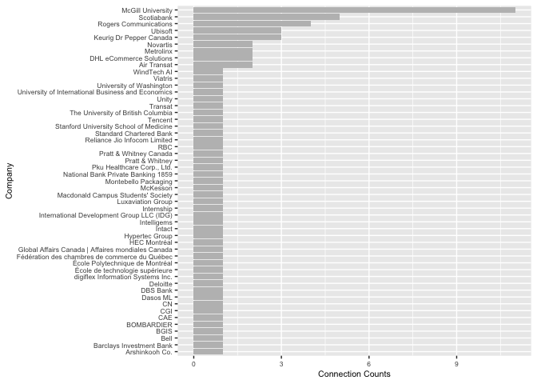
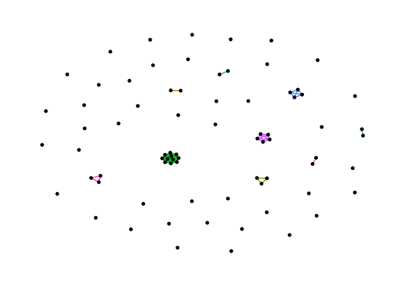

ex 1: linkedin network
================

## Import the File

Download linkedin network file and import to R:

``` r
library(tidyverse)
```

    ## ── Attaching packages ─────────────────────────────────────── tidyverse 1.3.1 ──

    ## ✓ ggplot2 3.3.5     ✓ purrr   0.3.4
    ## ✓ tibble  3.1.5     ✓ dplyr   1.0.7
    ## ✓ tidyr   1.1.4     ✓ stringr 1.4.0
    ## ✓ readr   2.0.2     ✓ forcats 0.5.1

    ## ── Conflicts ────────────────────────────────────────── tidyverse_conflicts() ──
    ## x dplyr::filter() masks stats::filter()
    ## x dplyr::lag()    masks stats::lag()

``` r
library(janitor)
```

    ## 
    ## Attaching package: 'janitor'

    ## The following objects are masked from 'package:stats':
    ## 
    ##     chisq.test, fisher.test

``` r
df = read_csv("/Users/hong/Desktop/McGill/ORGB/Connections.csv")
```

    ## Rows: 76 Columns: 6

    ## ── Column specification ────────────────────────────────────────────────────────
    ## Delimiter: ","
    ## chr (6): First Name, Last Name, Email Address, Company, Position, Connected On

    ## 
    ## ℹ Use `spec()` to retrieve the full column specification for this data.
    ## ℹ Specify the column types or set `show_col_types = FALSE` to quiet this message.

``` r
df <- clean_names(df)
df
```

    ## # A tibble: 76 × 6
    ##    first_name last_name             email_address company  position connected_on
    ##    <chr>      <chr>                 <chr>         <chr>    <chr>    <chr>       
    ##  1 Rayyan     mohammad              <NA>          Scotiab… Data An… 5-May-22    
    ##  2 Gautami    Edara                 <NA>          McKesson Busines… 3-May-22    
    ##  3 suresh     kumar                 <NA>          Relianc… Trainin… 3-May-22    
    ##  4 Franck     Benichou, M.A., M.Sc. <NA>          Intact   Data Sc… 20-Apr-22   
    ##  5 Vahid      Hedley                <NA>          Novartis Analyti… 15-Apr-22   
    ##  6 Rozita     Jalili                <NA>          digifle… Senior … 15-Apr-22   
    ##  7 Ananya     Nair                  <NA>          CN       Data Go… 15-Apr-22   
    ##  8 Nima       Rafizadeh             <NA>          HEC Mon… Graduat… 2-Apr-22    
    ##  9 Fahid      Hasin                 <NA>          Standar… Payment… 30-Mar-22   
    ## 10 Antoine    Payrar                <NA>          Nationa… Digital… 30-Mar-22   
    ## # … with 66 more rows

## Data Cleaning

Some company start with mcgill but has specific department, I will
change all of them to just mcgill university". Similar for Ubisoft. Some
people label their company as Ubisoft while others add specific studios
after ubisoft.

``` r
df <- df %>% 
  mutate(company = replace(company, str_detect(company, "McGill University"), "McGill University"))

df <- df %>% 
  mutate(company = replace(company, str_detect(company, "Ubisoft"), "Ubisoft"))
```

## Total number of contact:

``` r
length(df$first_name)
```

    ## [1] 76

## Plot the Counting result

``` r
library(dplyr)
company_count = df %>% count(company, sort = TRUE) ## count the number of ppl in each company

## plot the counts
company_count %>% ggplot(aes(y = reorder(company,n), x=n))+
  geom_col(fill="grey") +theme(text = element_text(size = 8)) +
  labs(
    x = "Connection Counts",
    y = "Company"
  )
```

<!-- --> \#\#
Create Nodes:

``` r
## Concat first name last name
name =  paste0(df$first_name,"_", df$last_name)
df$name = name
nodes <- df %>% select(name)
```

## Adding Connection Edges:

``` r
## Concat first name last name

df1 <- data.frame(df$name,df$company)
df2 <- data.frame(df$name,df$company)
edges <- full_join(df1, df2, by = "df.company")
names(edges) <- c("from", "company", "to")
```

## Linkedin Network

``` r
library("ggraph")
library("tidygraph")
```

    ## Warning: package 'tidygraph' was built under R version 4.1.2

    ## 
    ## Attaching package: 'tidygraph'

    ## The following object is masked from 'package:stats':
    ## 
    ##     filter

``` r
network <- tbl_graph(nodes=nodes, edges=edges, directed=FALSE)
network
```

    ## # A tbl_graph: 76 nodes and 238 edges
    ## #
    ## # An undirected multigraph with 51 components
    ## #
    ## # Node Data: 76 × 1 (active)
    ##   name                        
    ##   <chr>                       
    ## 1 Rayyan_mohammad             
    ## 2 Gautami_Edara               
    ## 3 suresh_kumar                
    ## 4 Franck_Benichou, M.A., M.Sc.
    ## 5 Vahid_Hedley                
    ## 6 Rozita_Jalili               
    ## # … with 70 more rows
    ## #
    ## # Edge Data: 238 × 3
    ##    from    to company   
    ##   <int> <int> <chr>     
    ## 1     1     1 Scotiabank
    ## 2     1    32 Scotiabank
    ## 3     1    35 Scotiabank
    ## # … with 235 more rows

## Plot:

``` r
ggraph(network, layout = "graphopt") + 
  geom_edge_link(aes(color = company), show.legend = FALSE) + 
  geom_node_point()+
  theme_graph()
```

<!-- -->
