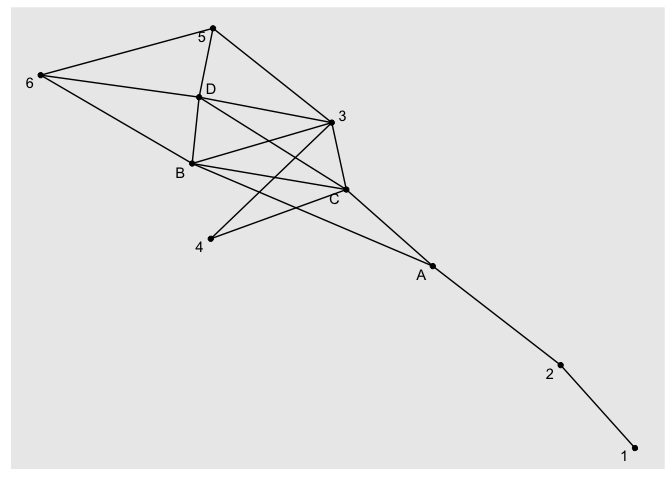
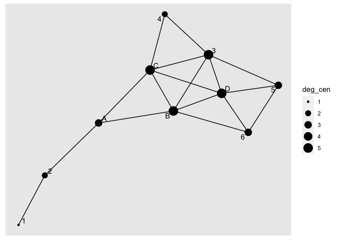
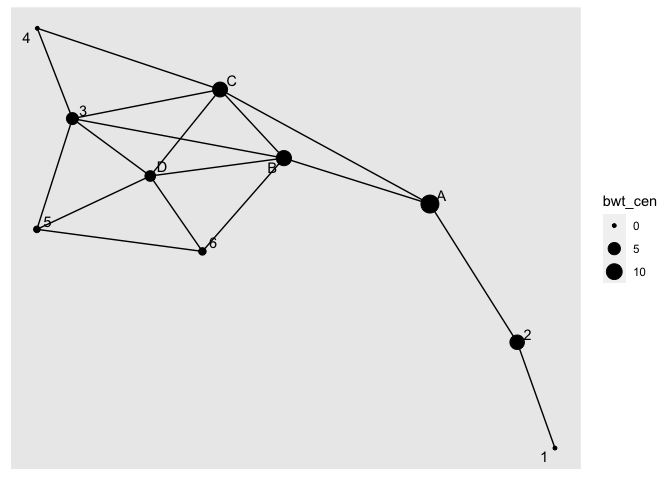

---
output:
  pdf_document: 
    latex_engine: xelatex
  html_document: default
---
ex2 facebook bus
================

## Ex 2 Facebook Bus

First I create a dataset based on the seats on the bus. The connection
rule is: communication is really possible with adjacent seats only, but
any type of adjacency works: side, front, back, diagonal, even across
the aisle.

## Load the csv sheet

``` r
library(tidyverse)
```

    ## ── Attaching packages ─────────────────────────────────────── tidyverse 1.3.1 ──

    ## ✓ ggplot2 3.3.5     ✓ purrr   0.3.4
    ## ✓ tibble  3.1.5     ✓ dplyr   1.0.7
    ## ✓ tidyr   1.1.4     ✓ stringr 1.4.0
    ## ✓ readr   2.0.2     ✓ forcats 0.5.1

    ## ── Conflicts ────────────────────────────────────────── tidyverse_conflicts() ──
    ## x dplyr::filter() masks stats::filter()
    ## x dplyr::lag()    masks stats::lag()

``` r
df = read_csv("~/Desktop/McGill/ORGB/2022-ona-assignments/ex2/facebook_bus.csv")
```

    ## Rows: 17 Columns: 2

    ## ── Column specification ────────────────────────────────────────────────────────
    ## Delimiter: ","
    ## chr (2): node_1, node_2

    ## 
    ## ℹ Use `spec()` to retrieve the full column specification for this data.
    ## ℹ Specify the column types or set `show_col_types = FALSE` to quiet this message.

``` r
library(dplyr)
## preprocessing
## change all the node type to character
df <- df %>%
        mutate(node_1 = as.character(node_1))
df <- df %>%
        mutate(node_2 = as.character(node_2))
```

## Create a network based on the relationship

``` r
library("ggraph")
library("tidygraph")
```

    ## Warning: package 'tidygraph' was built under R version 4.1.2

    ## 
    ## Attaching package: 'tidygraph'

    ## The following object is masked from 'package:stats':
    ## 
    ##     filter

``` r
nodes <- data.frame(nodes = c(1,2,3,4,5,6,"A","B","C","D"))
edges = df
network <- tbl_graph(nodes=nodes, edges=edges, directed=FALSE)
```

``` r
## plotting
ggraph(network, layout = "graphopt") + 
  geom_edge_link() + 
  geom_node_point()+geom_node_text(aes(label = nodes),repel = TRUE)
```

<!-- -->

``` r
  theme_graph()
```

    ## List of 93
    ##  $ line                      :List of 6
    ##   ..$ colour       : chr "black"
    ##   ..$ size         : num 0.5
    ##   ..$ linetype     : num 1
    ##   ..$ lineend      : chr "butt"
    ##   ..$ arrow        : logi FALSE
    ##   ..$ inherit.blank: logi TRUE
    ##   ..- attr(*, "class")= chr [1:2] "element_line" "element"
    ##  $ rect                      :List of 5
    ##   ..$ fill         : chr "white"
    ##   ..$ colour       : chr "black"
    ##   ..$ size         : num 0.5
    ##   ..$ linetype     : num 1
    ##   ..$ inherit.blank: logi TRUE
    ##   ..- attr(*, "class")= chr [1:2] "element_rect" "element"
    ##  $ text                      :List of 11
    ##   ..$ family       : chr "Arial Narrow"
    ##   ..$ face         : chr "plain"
    ##   ..$ colour       : chr "black"
    ##   ..$ size         : num 11
    ##   ..$ hjust        : num 0.5
    ##   ..$ vjust        : num 0.5
    ##   ..$ angle        : num 0
    ##   ..$ lineheight   : num 0.9
    ##   ..$ margin       : 'margin' num [1:4] 0points 0points 0points 0points
    ##   .. ..- attr(*, "unit")= int 8
    ##   ..$ debug        : logi FALSE
    ##   ..$ inherit.blank: logi FALSE
    ##   ..- attr(*, "class")= chr [1:2] "element_text" "element"
    ##  $ title                     : NULL
    ##  $ aspect.ratio              : NULL
    ##  $ axis.title                : list()
    ##   ..- attr(*, "class")= chr [1:2] "element_blank" "element"
    ##  $ axis.title.x              :List of 11
    ##   ..$ family       : NULL
    ##   ..$ face         : NULL
    ##   ..$ colour       : NULL
    ##   ..$ size         : NULL
    ##   ..$ hjust        : NULL
    ##   ..$ vjust        : num 1
    ##   ..$ angle        : NULL
    ##   ..$ lineheight   : NULL
    ##   ..$ margin       : 'margin' num [1:4] 2.75points 0points 0points 0points
    ##   .. ..- attr(*, "unit")= int 8
    ##   ..$ debug        : NULL
    ##   ..$ inherit.blank: logi TRUE
    ##   ..- attr(*, "class")= chr [1:2] "element_text" "element"
    ##  $ axis.title.x.top          :List of 11
    ##   ..$ family       : NULL
    ##   ..$ face         : NULL
    ##   ..$ colour       : NULL
    ##   ..$ size         : NULL
    ##   ..$ hjust        : NULL
    ##   ..$ vjust        : num 0
    ##   ..$ angle        : NULL
    ##   ..$ lineheight   : NULL
    ##   ..$ margin       : 'margin' num [1:4] 0points 0points 2.75points 0points
    ##   .. ..- attr(*, "unit")= int 8
    ##   ..$ debug        : NULL
    ##   ..$ inherit.blank: logi TRUE
    ##   ..- attr(*, "class")= chr [1:2] "element_text" "element"
    ##  $ axis.title.x.bottom       : NULL
    ##  $ axis.title.y              :List of 11
    ##   ..$ family       : NULL
    ##   ..$ face         : NULL
    ##   ..$ colour       : NULL
    ##   ..$ size         : NULL
    ##   ..$ hjust        : NULL
    ##   ..$ vjust        : num 1
    ##   ..$ angle        : num 90
    ##   ..$ lineheight   : NULL
    ##   ..$ margin       : 'margin' num [1:4] 0points 2.75points 0points 0points
    ##   .. ..- attr(*, "unit")= int 8
    ##   ..$ debug        : NULL
    ##   ..$ inherit.blank: logi TRUE
    ##   ..- attr(*, "class")= chr [1:2] "element_text" "element"
    ##  $ axis.title.y.left         : NULL
    ##  $ axis.title.y.right        :List of 11
    ##   ..$ family       : NULL
    ##   ..$ face         : NULL
    ##   ..$ colour       : NULL
    ##   ..$ size         : NULL
    ##   ..$ hjust        : NULL
    ##   ..$ vjust        : num 0
    ##   ..$ angle        : num -90
    ##   ..$ lineheight   : NULL
    ##   ..$ margin       : 'margin' num [1:4] 0points 0points 0points 2.75points
    ##   .. ..- attr(*, "unit")= int 8
    ##   ..$ debug        : NULL
    ##   ..$ inherit.blank: logi TRUE
    ##   ..- attr(*, "class")= chr [1:2] "element_text" "element"
    ##  $ axis.text                 : list()
    ##   ..- attr(*, "class")= chr [1:2] "element_blank" "element"
    ##  $ axis.text.x               :List of 11
    ##   ..$ family       : NULL
    ##   ..$ face         : NULL
    ##   ..$ colour       : NULL
    ##   ..$ size         : NULL
    ##   ..$ hjust        : NULL
    ##   ..$ vjust        : num 1
    ##   ..$ angle        : NULL
    ##   ..$ lineheight   : NULL
    ##   ..$ margin       : 'margin' num [1:4] 2.2points 0points 0points 0points
    ##   .. ..- attr(*, "unit")= int 8
    ##   ..$ debug        : NULL
    ##   ..$ inherit.blank: logi TRUE
    ##   ..- attr(*, "class")= chr [1:2] "element_text" "element"
    ##  $ axis.text.x.top           :List of 11
    ##   ..$ family       : NULL
    ##   ..$ face         : NULL
    ##   ..$ colour       : NULL
    ##   ..$ size         : NULL
    ##   ..$ hjust        : NULL
    ##   ..$ vjust        : num 0
    ##   ..$ angle        : NULL
    ##   ..$ lineheight   : NULL
    ##   ..$ margin       : 'margin' num [1:4] 0points 0points 2.2points 0points
    ##   .. ..- attr(*, "unit")= int 8
    ##   ..$ debug        : NULL
    ##   ..$ inherit.blank: logi TRUE
    ##   ..- attr(*, "class")= chr [1:2] "element_text" "element"
    ##  $ axis.text.x.bottom        : NULL
    ##  $ axis.text.y               :List of 11
    ##   ..$ family       : NULL
    ##   ..$ face         : NULL
    ##   ..$ colour       : NULL
    ##   ..$ size         : NULL
    ##   ..$ hjust        : num 1
    ##   ..$ vjust        : NULL
    ##   ..$ angle        : NULL
    ##   ..$ lineheight   : NULL
    ##   ..$ margin       : 'margin' num [1:4] 0points 2.2points 0points 0points
    ##   .. ..- attr(*, "unit")= int 8
    ##   ..$ debug        : NULL
    ##   ..$ inherit.blank: logi TRUE
    ##   ..- attr(*, "class")= chr [1:2] "element_text" "element"
    ##  $ axis.text.y.left          : NULL
    ##  $ axis.text.y.right         :List of 11
    ##   ..$ family       : NULL
    ##   ..$ face         : NULL
    ##   ..$ colour       : NULL
    ##   ..$ size         : NULL
    ##   ..$ hjust        : num 0
    ##   ..$ vjust        : NULL
    ##   ..$ angle        : NULL
    ##   ..$ lineheight   : NULL
    ##   ..$ margin       : 'margin' num [1:4] 0points 0points 0points 2.2points
    ##   .. ..- attr(*, "unit")= int 8
    ##   ..$ debug        : NULL
    ##   ..$ inherit.blank: logi TRUE
    ##   ..- attr(*, "class")= chr [1:2] "element_text" "element"
    ##  $ axis.ticks                : list()
    ##   ..- attr(*, "class")= chr [1:2] "element_blank" "element"
    ##  $ axis.ticks.x              : NULL
    ##  $ axis.ticks.x.top          : NULL
    ##  $ axis.ticks.x.bottom       : NULL
    ##  $ axis.ticks.y              : NULL
    ##  $ axis.ticks.y.left         : NULL
    ##  $ axis.ticks.y.right        : NULL
    ##  $ axis.ticks.length         : 'simpleUnit' num 2.75points
    ##   ..- attr(*, "unit")= int 8
    ##  $ axis.ticks.length.x       : NULL
    ##  $ axis.ticks.length.x.top   : NULL
    ##  $ axis.ticks.length.x.bottom: NULL
    ##  $ axis.ticks.length.y       : NULL
    ##  $ axis.ticks.length.y.left  : NULL
    ##  $ axis.ticks.length.y.right : NULL
    ##  $ axis.line                 : list()
    ##   ..- attr(*, "class")= chr [1:2] "element_blank" "element"
    ##  $ axis.line.x               : NULL
    ##  $ axis.line.x.top           : NULL
    ##  $ axis.line.x.bottom        : NULL
    ##  $ axis.line.y               : NULL
    ##  $ axis.line.y.left          : NULL
    ##  $ axis.line.y.right         : NULL
    ##  $ legend.background         : list()
    ##   ..- attr(*, "class")= chr [1:2] "element_blank" "element"
    ##  $ legend.margin             : 'margin' num [1:4] 5.5points 5.5points 5.5points 5.5points
    ##   ..- attr(*, "unit")= int 8
    ##  $ legend.spacing            : 'simpleUnit' num 11points
    ##   ..- attr(*, "unit")= int 8
    ##  $ legend.spacing.x          : NULL
    ##  $ legend.spacing.y          : NULL
    ##  $ legend.key                : list()
    ##   ..- attr(*, "class")= chr [1:2] "element_blank" "element"
    ##  $ legend.key.size           : 'simpleUnit' num 1.2lines
    ##   ..- attr(*, "unit")= int 3
    ##  $ legend.key.height         : NULL
    ##  $ legend.key.width          : NULL
    ##  $ legend.text               :List of 11
    ##   ..$ family       : NULL
    ##   ..$ face         : NULL
    ##   ..$ colour       : NULL
    ##   ..$ size         : 'rel' num 0.8
    ##   ..$ hjust        : NULL
    ##   ..$ vjust        : NULL
    ##   ..$ angle        : NULL
    ##   ..$ lineheight   : NULL
    ##   ..$ margin       : NULL
    ##   ..$ debug        : NULL
    ##   ..$ inherit.blank: logi TRUE
    ##   ..- attr(*, "class")= chr [1:2] "element_text" "element"
    ##  $ legend.text.align         : NULL
    ##  $ legend.title              :List of 11
    ##   ..$ family       : NULL
    ##   ..$ face         : NULL
    ##   ..$ colour       : NULL
    ##   ..$ size         : NULL
    ##   ..$ hjust        : num 0
    ##   ..$ vjust        : NULL
    ##   ..$ angle        : NULL
    ##   ..$ lineheight   : NULL
    ##   ..$ margin       : NULL
    ##   ..$ debug        : NULL
    ##   ..$ inherit.blank: logi TRUE
    ##   ..- attr(*, "class")= chr [1:2] "element_text" "element"
    ##  $ legend.title.align        : NULL
    ##  $ legend.position           : chr "right"
    ##  $ legend.direction          : NULL
    ##  $ legend.justification      : chr "center"
    ##  $ legend.box                : NULL
    ##  $ legend.box.just           : NULL
    ##  $ legend.box.margin         : 'margin' num [1:4] 0cm 0cm 0cm 0cm
    ##   ..- attr(*, "unit")= int 1
    ##  $ legend.box.background     : list()
    ##   ..- attr(*, "class")= chr [1:2] "element_blank" "element"
    ##  $ legend.box.spacing        : 'simpleUnit' num 11points
    ##   ..- attr(*, "unit")= int 8
    ##  $ panel.background          : list()
    ##   ..- attr(*, "class")= chr [1:2] "element_blank" "element"
    ##  $ panel.border              : list()
    ##   ..- attr(*, "class")= chr [1:2] "element_blank" "element"
    ##  $ panel.spacing             : 'simpleUnit' num 5.5points
    ##   ..- attr(*, "unit")= int 8
    ##  $ panel.spacing.x           : NULL
    ##  $ panel.spacing.y           : NULL
    ##  $ panel.grid                : list()
    ##   ..- attr(*, "class")= chr [1:2] "element_blank" "element"
    ##  $ panel.grid.major          : NULL
    ##  $ panel.grid.minor          :List of 6
    ##   ..$ colour       : NULL
    ##   ..$ size         : 'rel' num 0.5
    ##   ..$ linetype     : NULL
    ##   ..$ lineend      : NULL
    ##   ..$ arrow        : logi FALSE
    ##   ..$ inherit.blank: logi TRUE
    ##   ..- attr(*, "class")= chr [1:2] "element_line" "element"
    ##  $ panel.grid.major.x        : NULL
    ##  $ panel.grid.major.y        : NULL
    ##  $ panel.grid.minor.x        : NULL
    ##  $ panel.grid.minor.y        : NULL
    ##  $ panel.ontop               : logi FALSE
    ##  $ plot.background           :List of 5
    ##   ..$ fill         : chr "white"
    ##   ..$ colour       : logi NA
    ##   ..$ size         : NULL
    ##   ..$ linetype     : NULL
    ##   ..$ inherit.blank: logi FALSE
    ##   ..- attr(*, "class")= chr [1:2] "element_rect" "element"
    ##  $ plot.title                :List of 11
    ##   ..$ family       : chr "Arial Narrow"
    ##   ..$ face         : chr "bold"
    ##   ..$ colour       : chr "black"
    ##   ..$ size         : num 18
    ##   ..$ hjust        : num 0
    ##   ..$ vjust        : num 1
    ##   ..$ angle        : NULL
    ##   ..$ lineheight   : NULL
    ##   ..$ margin       : 'margin' num [1:4] 0points 0points 10points 0points
    ##   .. ..- attr(*, "unit")= int 8
    ##   ..$ debug        : NULL
    ##   ..$ inherit.blank: logi FALSE
    ##   ..- attr(*, "class")= chr [1:2] "element_text" "element"
    ##  $ plot.title.position       : chr "panel"
    ##  $ plot.subtitle             :List of 11
    ##   ..$ family       : chr "Arial Narrow"
    ##   ..$ face         : chr "plain"
    ##   ..$ colour       : chr "black"
    ##   ..$ size         : num 12
    ##   ..$ hjust        : num 0
    ##   ..$ vjust        : num 1
    ##   ..$ angle        : NULL
    ##   ..$ lineheight   : NULL
    ##   ..$ margin       : 'margin' num [1:4] 0points 0points 15points 0points
    ##   .. ..- attr(*, "unit")= int 8
    ##   ..$ debug        : NULL
    ##   ..$ inherit.blank: logi FALSE
    ##   ..- attr(*, "class")= chr [1:2] "element_text" "element"
    ##  $ plot.caption              :List of 11
    ##   ..$ family       : chr "Arial Narrow"
    ##   ..$ face         : chr "italic"
    ##   ..$ colour       : chr "black"
    ##   ..$ size         : num 9
    ##   ..$ hjust        : num 1
    ##   ..$ vjust        : num 1
    ##   ..$ angle        : NULL
    ##   ..$ lineheight   : NULL
    ##   ..$ margin       : 'margin' num [1:4] 10points 0points 0points 0points
    ##   .. ..- attr(*, "unit")= int 8
    ##   ..$ debug        : NULL
    ##   ..$ inherit.blank: logi FALSE
    ##   ..- attr(*, "class")= chr [1:2] "element_text" "element"
    ##  $ plot.caption.position     : chr "panel"
    ##  $ plot.tag                  :List of 11
    ##   ..$ family       : NULL
    ##   ..$ face         : NULL
    ##   ..$ colour       : NULL
    ##   ..$ size         : 'rel' num 1.2
    ##   ..$ hjust        : num 0.5
    ##   ..$ vjust        : num 0.5
    ##   ..$ angle        : NULL
    ##   ..$ lineheight   : NULL
    ##   ..$ margin       : NULL
    ##   ..$ debug        : NULL
    ##   ..$ inherit.blank: logi TRUE
    ##   ..- attr(*, "class")= chr [1:2] "element_text" "element"
    ##  $ plot.tag.position         : chr "topleft"
    ##  $ plot.margin               : 'margin' num [1:4] 30points 30points 30points 30points
    ##   ..- attr(*, "unit")= int 8
    ##  $ strip.background          : list()
    ##   ..- attr(*, "class")= chr [1:2] "element_blank" "element"
    ##  $ strip.background.x        : NULL
    ##  $ strip.background.y        : NULL
    ##  $ strip.placement           : chr "inside"
    ##  $ strip.text                :List of 11
    ##   ..$ family       : chr "Arial Narrow"
    ##   ..$ face         : chr "bold"
    ##   ..$ colour       : chr "black"
    ##   ..$ size         : num 10
    ##   ..$ hjust        : NULL
    ##   ..$ vjust        : NULL
    ##   ..$ angle        : NULL
    ##   ..$ lineheight   : NULL
    ##   ..$ margin       : 'margin' num [1:4] 4.4points 4.4points 4.4points 4.4points
    ##   .. ..- attr(*, "unit")= int 8
    ##   ..$ debug        : NULL
    ##   ..$ inherit.blank: logi FALSE
    ##   ..- attr(*, "class")= chr [1:2] "element_text" "element"
    ##  $ strip.text.x              : NULL
    ##  $ strip.text.y              :List of 11
    ##   ..$ family       : NULL
    ##   ..$ face         : NULL
    ##   ..$ colour       : NULL
    ##   ..$ size         : NULL
    ##   ..$ hjust        : NULL
    ##   ..$ vjust        : NULL
    ##   ..$ angle        : num -90
    ##   ..$ lineheight   : NULL
    ##   ..$ margin       : NULL
    ##   ..$ debug        : NULL
    ##   ..$ inherit.blank: logi TRUE
    ##   ..- attr(*, "class")= chr [1:2] "element_text" "element"
    ##  $ strip.switch.pad.grid     : 'simpleUnit' num 2.75points
    ##   ..- attr(*, "unit")= int 8
    ##  $ strip.switch.pad.wrap     : 'simpleUnit' num 2.75points
    ##   ..- attr(*, "unit")= int 8
    ##  $ strip.text.y.left         :List of 11
    ##   ..$ family       : NULL
    ##   ..$ face         : NULL
    ##   ..$ colour       : NULL
    ##   ..$ size         : NULL
    ##   ..$ hjust        : NULL
    ##   ..$ vjust        : NULL
    ##   ..$ angle        : num 90
    ##   ..$ lineheight   : NULL
    ##   ..$ margin       : NULL
    ##   ..$ debug        : NULL
    ##   ..$ inherit.blank: logi TRUE
    ##   ..- attr(*, "class")= chr [1:2] "element_text" "element"
    ##  - attr(*, "class")= chr [1:2] "theme" "gg"
    ##  - attr(*, "complete")= logi TRUE
    ##  - attr(*, "validate")= logi TRUE

## Calculate various measures of centrality

``` r
## centrality degree
network_centrality_degree = network %>%
  activate(nodes) %>%
  mutate(degree = centrality_degree()) %>%
  as_tibble()

## centrality betweeness
network_betweenness_centrality = network %>%
  activate(nodes) %>%
  mutate(betw = centrality_betweenness()) %>%
  arrange(desc(betw)) %>% as_tibble()
```

    ## Warning in betweenness(graph = graph, v = V(graph), directed = directed, :
    ## 'nobigint' is deprecated since igraph 1.3 and will be removed in igraph 1.4

``` r
network_centrality_degree
```

    ## # A tibble: 10 × 2
    ##    nodes degree
    ##    <chr>  <dbl>
    ##  1 1          1
    ##  2 2          2
    ##  3 3          5
    ##  4 4          2
    ##  5 5          3
    ##  6 6          3
    ##  7 A          3
    ##  8 B          5
    ##  9 C          5
    ## 10 D          5

``` r
network_betweenness_centrality
```

    ## # A tibble: 10 × 2
    ##    nodes   betw
    ##    <chr>  <dbl>
    ##  1 A     14    
    ##  2 B      9.03 
    ##  3 C      8.6  
    ##  4 2      8    
    ##  5 3      4.63 
    ##  6 D      3.27 
    ##  7 6      0.933
    ##  8 5      0.533
    ##  9 1      0    
    ## 10 4      0

## Choice of Seats

The of a node is simply its degree—the number of edges it has.

measures the extent to which a vertex lies on paths between other
vertices. Vertices with high betweenness may have considerable influence
within a network by virtue of their control over information passing
between others.

In order to maximize the change of building a relationship between
co-workers, I will need to pick a seat that can talk to as much people
as possible, meaning a seats with high centrality degree. Also, I would
like a seat with high betweenness centrality, because that seats will
help me passing information to others.

If we calculate the “value” of a seats by adding the degree centrality
and betweenness centrality. The seat that has the highest value will be
B. This choice is beneficial if seats D,C and A will be filled. It will
be even more beneficial if people who will seat at D,C or C are
permanent worker at facebook. It is not so beneficial if people who seat
at D,C or A are interns like me. It is even less benificial if no one
will seats at D,C and A.

## Plot the network graph with labels and centrality values

``` r
name <- c("1","2","3","4","5","6","A","B","C","D")
deg_cen <- c(1,2,5,2,3,3,3,5,5,5)
bwt_cen <- c(0,8,4.63,0,0.5333333,0.9333333,14,9.0333333,8.6000000,3.2666667)
nodes <- data.frame(name, deg_cen,bwt_cen)

network_2 <- tbl_graph(nodes=nodes, edges=edges, directed=FALSE)
```

### Plot based on degree centrality

``` r
ggraph(network, layout = "graphopt") + 
  geom_edge_link() + 
  geom_node_point(aes(size = deg_cen))+geom_node_text(aes(label = nodes),repel = TRUE)
```

<!-- -->

``` r
  theme_graph()
```

    ## List of 93
    ##  $ line                      :List of 6
    ##   ..$ colour       : chr "black"
    ##   ..$ size         : num 0.5
    ##   ..$ linetype     : num 1
    ##   ..$ lineend      : chr "butt"
    ##   ..$ arrow        : logi FALSE
    ##   ..$ inherit.blank: logi TRUE
    ##   ..- attr(*, "class")= chr [1:2] "element_line" "element"
    ##  $ rect                      :List of 5
    ##   ..$ fill         : chr "white"
    ##   ..$ colour       : chr "black"
    ##   ..$ size         : num 0.5
    ##   ..$ linetype     : num 1
    ##   ..$ inherit.blank: logi TRUE
    ##   ..- attr(*, "class")= chr [1:2] "element_rect" "element"
    ##  $ text                      :List of 11
    ##   ..$ family       : chr "Arial Narrow"
    ##   ..$ face         : chr "plain"
    ##   ..$ colour       : chr "black"
    ##   ..$ size         : num 11
    ##   ..$ hjust        : num 0.5
    ##   ..$ vjust        : num 0.5
    ##   ..$ angle        : num 0
    ##   ..$ lineheight   : num 0.9
    ##   ..$ margin       : 'margin' num [1:4] 0points 0points 0points 0points
    ##   .. ..- attr(*, "unit")= int 8
    ##   ..$ debug        : logi FALSE
    ##   ..$ inherit.blank: logi FALSE
    ##   ..- attr(*, "class")= chr [1:2] "element_text" "element"
    ##  $ title                     : NULL
    ##  $ aspect.ratio              : NULL
    ##  $ axis.title                : list()
    ##   ..- attr(*, "class")= chr [1:2] "element_blank" "element"
    ##  $ axis.title.x              :List of 11
    ##   ..$ family       : NULL
    ##   ..$ face         : NULL
    ##   ..$ colour       : NULL
    ##   ..$ size         : NULL
    ##   ..$ hjust        : NULL
    ##   ..$ vjust        : num 1
    ##   ..$ angle        : NULL
    ##   ..$ lineheight   : NULL
    ##   ..$ margin       : 'margin' num [1:4] 2.75points 0points 0points 0points
    ##   .. ..- attr(*, "unit")= int 8
    ##   ..$ debug        : NULL
    ##   ..$ inherit.blank: logi TRUE
    ##   ..- attr(*, "class")= chr [1:2] "element_text" "element"
    ##  $ axis.title.x.top          :List of 11
    ##   ..$ family       : NULL
    ##   ..$ face         : NULL
    ##   ..$ colour       : NULL
    ##   ..$ size         : NULL
    ##   ..$ hjust        : NULL
    ##   ..$ vjust        : num 0
    ##   ..$ angle        : NULL
    ##   ..$ lineheight   : NULL
    ##   ..$ margin       : 'margin' num [1:4] 0points 0points 2.75points 0points
    ##   .. ..- attr(*, "unit")= int 8
    ##   ..$ debug        : NULL
    ##   ..$ inherit.blank: logi TRUE
    ##   ..- attr(*, "class")= chr [1:2] "element_text" "element"
    ##  $ axis.title.x.bottom       : NULL
    ##  $ axis.title.y              :List of 11
    ##   ..$ family       : NULL
    ##   ..$ face         : NULL
    ##   ..$ colour       : NULL
    ##   ..$ size         : NULL
    ##   ..$ hjust        : NULL
    ##   ..$ vjust        : num 1
    ##   ..$ angle        : num 90
    ##   ..$ lineheight   : NULL
    ##   ..$ margin       : 'margin' num [1:4] 0points 2.75points 0points 0points
    ##   .. ..- attr(*, "unit")= int 8
    ##   ..$ debug        : NULL
    ##   ..$ inherit.blank: logi TRUE
    ##   ..- attr(*, "class")= chr [1:2] "element_text" "element"
    ##  $ axis.title.y.left         : NULL
    ##  $ axis.title.y.right        :List of 11
    ##   ..$ family       : NULL
    ##   ..$ face         : NULL
    ##   ..$ colour       : NULL
    ##   ..$ size         : NULL
    ##   ..$ hjust        : NULL
    ##   ..$ vjust        : num 0
    ##   ..$ angle        : num -90
    ##   ..$ lineheight   : NULL
    ##   ..$ margin       : 'margin' num [1:4] 0points 0points 0points 2.75points
    ##   .. ..- attr(*, "unit")= int 8
    ##   ..$ debug        : NULL
    ##   ..$ inherit.blank: logi TRUE
    ##   ..- attr(*, "class")= chr [1:2] "element_text" "element"
    ##  $ axis.text                 : list()
    ##   ..- attr(*, "class")= chr [1:2] "element_blank" "element"
    ##  $ axis.text.x               :List of 11
    ##   ..$ family       : NULL
    ##   ..$ face         : NULL
    ##   ..$ colour       : NULL
    ##   ..$ size         : NULL
    ##   ..$ hjust        : NULL
    ##   ..$ vjust        : num 1
    ##   ..$ angle        : NULL
    ##   ..$ lineheight   : NULL
    ##   ..$ margin       : 'margin' num [1:4] 2.2points 0points 0points 0points
    ##   .. ..- attr(*, "unit")= int 8
    ##   ..$ debug        : NULL
    ##   ..$ inherit.blank: logi TRUE
    ##   ..- attr(*, "class")= chr [1:2] "element_text" "element"
    ##  $ axis.text.x.top           :List of 11
    ##   ..$ family       : NULL
    ##   ..$ face         : NULL
    ##   ..$ colour       : NULL
    ##   ..$ size         : NULL
    ##   ..$ hjust        : NULL
    ##   ..$ vjust        : num 0
    ##   ..$ angle        : NULL
    ##   ..$ lineheight   : NULL
    ##   ..$ margin       : 'margin' num [1:4] 0points 0points 2.2points 0points
    ##   .. ..- attr(*, "unit")= int 8
    ##   ..$ debug        : NULL
    ##   ..$ inherit.blank: logi TRUE
    ##   ..- attr(*, "class")= chr [1:2] "element_text" "element"
    ##  $ axis.text.x.bottom        : NULL
    ##  $ axis.text.y               :List of 11
    ##   ..$ family       : NULL
    ##   ..$ face         : NULL
    ##   ..$ colour       : NULL
    ##   ..$ size         : NULL
    ##   ..$ hjust        : num 1
    ##   ..$ vjust        : NULL
    ##   ..$ angle        : NULL
    ##   ..$ lineheight   : NULL
    ##   ..$ margin       : 'margin' num [1:4] 0points 2.2points 0points 0points
    ##   .. ..- attr(*, "unit")= int 8
    ##   ..$ debug        : NULL
    ##   ..$ inherit.blank: logi TRUE
    ##   ..- attr(*, "class")= chr [1:2] "element_text" "element"
    ##  $ axis.text.y.left          : NULL
    ##  $ axis.text.y.right         :List of 11
    ##   ..$ family       : NULL
    ##   ..$ face         : NULL
    ##   ..$ colour       : NULL
    ##   ..$ size         : NULL
    ##   ..$ hjust        : num 0
    ##   ..$ vjust        : NULL
    ##   ..$ angle        : NULL
    ##   ..$ lineheight   : NULL
    ##   ..$ margin       : 'margin' num [1:4] 0points 0points 0points 2.2points
    ##   .. ..- attr(*, "unit")= int 8
    ##   ..$ debug        : NULL
    ##   ..$ inherit.blank: logi TRUE
    ##   ..- attr(*, "class")= chr [1:2] "element_text" "element"
    ##  $ axis.ticks                : list()
    ##   ..- attr(*, "class")= chr [1:2] "element_blank" "element"
    ##  $ axis.ticks.x              : NULL
    ##  $ axis.ticks.x.top          : NULL
    ##  $ axis.ticks.x.bottom       : NULL
    ##  $ axis.ticks.y              : NULL
    ##  $ axis.ticks.y.left         : NULL
    ##  $ axis.ticks.y.right        : NULL
    ##  $ axis.ticks.length         : 'simpleUnit' num 2.75points
    ##   ..- attr(*, "unit")= int 8
    ##  $ axis.ticks.length.x       : NULL
    ##  $ axis.ticks.length.x.top   : NULL
    ##  $ axis.ticks.length.x.bottom: NULL
    ##  $ axis.ticks.length.y       : NULL
    ##  $ axis.ticks.length.y.left  : NULL
    ##  $ axis.ticks.length.y.right : NULL
    ##  $ axis.line                 : list()
    ##   ..- attr(*, "class")= chr [1:2] "element_blank" "element"
    ##  $ axis.line.x               : NULL
    ##  $ axis.line.x.top           : NULL
    ##  $ axis.line.x.bottom        : NULL
    ##  $ axis.line.y               : NULL
    ##  $ axis.line.y.left          : NULL
    ##  $ axis.line.y.right         : NULL
    ##  $ legend.background         : list()
    ##   ..- attr(*, "class")= chr [1:2] "element_blank" "element"
    ##  $ legend.margin             : 'margin' num [1:4] 5.5points 5.5points 5.5points 5.5points
    ##   ..- attr(*, "unit")= int 8
    ##  $ legend.spacing            : 'simpleUnit' num 11points
    ##   ..- attr(*, "unit")= int 8
    ##  $ legend.spacing.x          : NULL
    ##  $ legend.spacing.y          : NULL
    ##  $ legend.key                : list()
    ##   ..- attr(*, "class")= chr [1:2] "element_blank" "element"
    ##  $ legend.key.size           : 'simpleUnit' num 1.2lines
    ##   ..- attr(*, "unit")= int 3
    ##  $ legend.key.height         : NULL
    ##  $ legend.key.width          : NULL
    ##  $ legend.text               :List of 11
    ##   ..$ family       : NULL
    ##   ..$ face         : NULL
    ##   ..$ colour       : NULL
    ##   ..$ size         : 'rel' num 0.8
    ##   ..$ hjust        : NULL
    ##   ..$ vjust        : NULL
    ##   ..$ angle        : NULL
    ##   ..$ lineheight   : NULL
    ##   ..$ margin       : NULL
    ##   ..$ debug        : NULL
    ##   ..$ inherit.blank: logi TRUE
    ##   ..- attr(*, "class")= chr [1:2] "element_text" "element"
    ##  $ legend.text.align         : NULL
    ##  $ legend.title              :List of 11
    ##   ..$ family       : NULL
    ##   ..$ face         : NULL
    ##   ..$ colour       : NULL
    ##   ..$ size         : NULL
    ##   ..$ hjust        : num 0
    ##   ..$ vjust        : NULL
    ##   ..$ angle        : NULL
    ##   ..$ lineheight   : NULL
    ##   ..$ margin       : NULL
    ##   ..$ debug        : NULL
    ##   ..$ inherit.blank: logi TRUE
    ##   ..- attr(*, "class")= chr [1:2] "element_text" "element"
    ##  $ legend.title.align        : NULL
    ##  $ legend.position           : chr "right"
    ##  $ legend.direction          : NULL
    ##  $ legend.justification      : chr "center"
    ##  $ legend.box                : NULL
    ##  $ legend.box.just           : NULL
    ##  $ legend.box.margin         : 'margin' num [1:4] 0cm 0cm 0cm 0cm
    ##   ..- attr(*, "unit")= int 1
    ##  $ legend.box.background     : list()
    ##   ..- attr(*, "class")= chr [1:2] "element_blank" "element"
    ##  $ legend.box.spacing        : 'simpleUnit' num 11points
    ##   ..- attr(*, "unit")= int 8
    ##  $ panel.background          : list()
    ##   ..- attr(*, "class")= chr [1:2] "element_blank" "element"
    ##  $ panel.border              : list()
    ##   ..- attr(*, "class")= chr [1:2] "element_blank" "element"
    ##  $ panel.spacing             : 'simpleUnit' num 5.5points
    ##   ..- attr(*, "unit")= int 8
    ##  $ panel.spacing.x           : NULL
    ##  $ panel.spacing.y           : NULL
    ##  $ panel.grid                : list()
    ##   ..- attr(*, "class")= chr [1:2] "element_blank" "element"
    ##  $ panel.grid.major          : NULL
    ##  $ panel.grid.minor          :List of 6
    ##   ..$ colour       : NULL
    ##   ..$ size         : 'rel' num 0.5
    ##   ..$ linetype     : NULL
    ##   ..$ lineend      : NULL
    ##   ..$ arrow        : logi FALSE
    ##   ..$ inherit.blank: logi TRUE
    ##   ..- attr(*, "class")= chr [1:2] "element_line" "element"
    ##  $ panel.grid.major.x        : NULL
    ##  $ panel.grid.major.y        : NULL
    ##  $ panel.grid.minor.x        : NULL
    ##  $ panel.grid.minor.y        : NULL
    ##  $ panel.ontop               : logi FALSE
    ##  $ plot.background           :List of 5
    ##   ..$ fill         : chr "white"
    ##   ..$ colour       : logi NA
    ##   ..$ size         : NULL
    ##   ..$ linetype     : NULL
    ##   ..$ inherit.blank: logi FALSE
    ##   ..- attr(*, "class")= chr [1:2] "element_rect" "element"
    ##  $ plot.title                :List of 11
    ##   ..$ family       : chr "Arial Narrow"
    ##   ..$ face         : chr "bold"
    ##   ..$ colour       : chr "black"
    ##   ..$ size         : num 18
    ##   ..$ hjust        : num 0
    ##   ..$ vjust        : num 1
    ##   ..$ angle        : NULL
    ##   ..$ lineheight   : NULL
    ##   ..$ margin       : 'margin' num [1:4] 0points 0points 10points 0points
    ##   .. ..- attr(*, "unit")= int 8
    ##   ..$ debug        : NULL
    ##   ..$ inherit.blank: logi FALSE
    ##   ..- attr(*, "class")= chr [1:2] "element_text" "element"
    ##  $ plot.title.position       : chr "panel"
    ##  $ plot.subtitle             :List of 11
    ##   ..$ family       : chr "Arial Narrow"
    ##   ..$ face         : chr "plain"
    ##   ..$ colour       : chr "black"
    ##   ..$ size         : num 12
    ##   ..$ hjust        : num 0
    ##   ..$ vjust        : num 1
    ##   ..$ angle        : NULL
    ##   ..$ lineheight   : NULL
    ##   ..$ margin       : 'margin' num [1:4] 0points 0points 15points 0points
    ##   .. ..- attr(*, "unit")= int 8
    ##   ..$ debug        : NULL
    ##   ..$ inherit.blank: logi FALSE
    ##   ..- attr(*, "class")= chr [1:2] "element_text" "element"
    ##  $ plot.caption              :List of 11
    ##   ..$ family       : chr "Arial Narrow"
    ##   ..$ face         : chr "italic"
    ##   ..$ colour       : chr "black"
    ##   ..$ size         : num 9
    ##   ..$ hjust        : num 1
    ##   ..$ vjust        : num 1
    ##   ..$ angle        : NULL
    ##   ..$ lineheight   : NULL
    ##   ..$ margin       : 'margin' num [1:4] 10points 0points 0points 0points
    ##   .. ..- attr(*, "unit")= int 8
    ##   ..$ debug        : NULL
    ##   ..$ inherit.blank: logi FALSE
    ##   ..- attr(*, "class")= chr [1:2] "element_text" "element"
    ##  $ plot.caption.position     : chr "panel"
    ##  $ plot.tag                  :List of 11
    ##   ..$ family       : NULL
    ##   ..$ face         : NULL
    ##   ..$ colour       : NULL
    ##   ..$ size         : 'rel' num 1.2
    ##   ..$ hjust        : num 0.5
    ##   ..$ vjust        : num 0.5
    ##   ..$ angle        : NULL
    ##   ..$ lineheight   : NULL
    ##   ..$ margin       : NULL
    ##   ..$ debug        : NULL
    ##   ..$ inherit.blank: logi TRUE
    ##   ..- attr(*, "class")= chr [1:2] "element_text" "element"
    ##  $ plot.tag.position         : chr "topleft"
    ##  $ plot.margin               : 'margin' num [1:4] 30points 30points 30points 30points
    ##   ..- attr(*, "unit")= int 8
    ##  $ strip.background          : list()
    ##   ..- attr(*, "class")= chr [1:2] "element_blank" "element"
    ##  $ strip.background.x        : NULL
    ##  $ strip.background.y        : NULL
    ##  $ strip.placement           : chr "inside"
    ##  $ strip.text                :List of 11
    ##   ..$ family       : chr "Arial Narrow"
    ##   ..$ face         : chr "bold"
    ##   ..$ colour       : chr "black"
    ##   ..$ size         : num 10
    ##   ..$ hjust        : NULL
    ##   ..$ vjust        : NULL
    ##   ..$ angle        : NULL
    ##   ..$ lineheight   : NULL
    ##   ..$ margin       : 'margin' num [1:4] 4.4points 4.4points 4.4points 4.4points
    ##   .. ..- attr(*, "unit")= int 8
    ##   ..$ debug        : NULL
    ##   ..$ inherit.blank: logi FALSE
    ##   ..- attr(*, "class")= chr [1:2] "element_text" "element"
    ##  $ strip.text.x              : NULL
    ##  $ strip.text.y              :List of 11
    ##   ..$ family       : NULL
    ##   ..$ face         : NULL
    ##   ..$ colour       : NULL
    ##   ..$ size         : NULL
    ##   ..$ hjust        : NULL
    ##   ..$ vjust        : NULL
    ##   ..$ angle        : num -90
    ##   ..$ lineheight   : NULL
    ##   ..$ margin       : NULL
    ##   ..$ debug        : NULL
    ##   ..$ inherit.blank: logi TRUE
    ##   ..- attr(*, "class")= chr [1:2] "element_text" "element"
    ##  $ strip.switch.pad.grid     : 'simpleUnit' num 2.75points
    ##   ..- attr(*, "unit")= int 8
    ##  $ strip.switch.pad.wrap     : 'simpleUnit' num 2.75points
    ##   ..- attr(*, "unit")= int 8
    ##  $ strip.text.y.left         :List of 11
    ##   ..$ family       : NULL
    ##   ..$ face         : NULL
    ##   ..$ colour       : NULL
    ##   ..$ size         : NULL
    ##   ..$ hjust        : NULL
    ##   ..$ vjust        : NULL
    ##   ..$ angle        : num 90
    ##   ..$ lineheight   : NULL
    ##   ..$ margin       : NULL
    ##   ..$ debug        : NULL
    ##   ..$ inherit.blank: logi TRUE
    ##   ..- attr(*, "class")= chr [1:2] "element_text" "element"
    ##  - attr(*, "class")= chr [1:2] "theme" "gg"
    ##  - attr(*, "complete")= logi TRUE
    ##  - attr(*, "validate")= logi TRUE

### Plotting based on betweenness centrality

``` r
ggraph(network, layout = "graphopt") + 
  geom_edge_link() + 
  geom_node_point(aes(size = bwt_cen))+geom_node_text(aes(label = nodes),repel = TRUE)
```

<!-- -->

``` r
  theme_graph()
```

    ## List of 93
    ##  $ line                      :List of 6
    ##   ..$ colour       : chr "black"
    ##   ..$ size         : num 0.5
    ##   ..$ linetype     : num 1
    ##   ..$ lineend      : chr "butt"
    ##   ..$ arrow        : logi FALSE
    ##   ..$ inherit.blank: logi TRUE
    ##   ..- attr(*, "class")= chr [1:2] "element_line" "element"
    ##  $ rect                      :List of 5
    ##   ..$ fill         : chr "white"
    ##   ..$ colour       : chr "black"
    ##   ..$ size         : num 0.5
    ##   ..$ linetype     : num 1
    ##   ..$ inherit.blank: logi TRUE
    ##   ..- attr(*, "class")= chr [1:2] "element_rect" "element"
    ##  $ text                      :List of 11
    ##   ..$ family       : chr "Arial Narrow"
    ##   ..$ face         : chr "plain"
    ##   ..$ colour       : chr "black"
    ##   ..$ size         : num 11
    ##   ..$ hjust        : num 0.5
    ##   ..$ vjust        : num 0.5
    ##   ..$ angle        : num 0
    ##   ..$ lineheight   : num 0.9
    ##   ..$ margin       : 'margin' num [1:4] 0points 0points 0points 0points
    ##   .. ..- attr(*, "unit")= int 8
    ##   ..$ debug        : logi FALSE
    ##   ..$ inherit.blank: logi FALSE
    ##   ..- attr(*, "class")= chr [1:2] "element_text" "element"
    ##  $ title                     : NULL
    ##  $ aspect.ratio              : NULL
    ##  $ axis.title                : list()
    ##   ..- attr(*, "class")= chr [1:2] "element_blank" "element"
    ##  $ axis.title.x              :List of 11
    ##   ..$ family       : NULL
    ##   ..$ face         : NULL
    ##   ..$ colour       : NULL
    ##   ..$ size         : NULL
    ##   ..$ hjust        : NULL
    ##   ..$ vjust        : num 1
    ##   ..$ angle        : NULL
    ##   ..$ lineheight   : NULL
    ##   ..$ margin       : 'margin' num [1:4] 2.75points 0points 0points 0points
    ##   .. ..- attr(*, "unit")= int 8
    ##   ..$ debug        : NULL
    ##   ..$ inherit.blank: logi TRUE
    ##   ..- attr(*, "class")= chr [1:2] "element_text" "element"
    ##  $ axis.title.x.top          :List of 11
    ##   ..$ family       : NULL
    ##   ..$ face         : NULL
    ##   ..$ colour       : NULL
    ##   ..$ size         : NULL
    ##   ..$ hjust        : NULL
    ##   ..$ vjust        : num 0
    ##   ..$ angle        : NULL
    ##   ..$ lineheight   : NULL
    ##   ..$ margin       : 'margin' num [1:4] 0points 0points 2.75points 0points
    ##   .. ..- attr(*, "unit")= int 8
    ##   ..$ debug        : NULL
    ##   ..$ inherit.blank: logi TRUE
    ##   ..- attr(*, "class")= chr [1:2] "element_text" "element"
    ##  $ axis.title.x.bottom       : NULL
    ##  $ axis.title.y              :List of 11
    ##   ..$ family       : NULL
    ##   ..$ face         : NULL
    ##   ..$ colour       : NULL
    ##   ..$ size         : NULL
    ##   ..$ hjust        : NULL
    ##   ..$ vjust        : num 1
    ##   ..$ angle        : num 90
    ##   ..$ lineheight   : NULL
    ##   ..$ margin       : 'margin' num [1:4] 0points 2.75points 0points 0points
    ##   .. ..- attr(*, "unit")= int 8
    ##   ..$ debug        : NULL
    ##   ..$ inherit.blank: logi TRUE
    ##   ..- attr(*, "class")= chr [1:2] "element_text" "element"
    ##  $ axis.title.y.left         : NULL
    ##  $ axis.title.y.right        :List of 11
    ##   ..$ family       : NULL
    ##   ..$ face         : NULL
    ##   ..$ colour       : NULL
    ##   ..$ size         : NULL
    ##   ..$ hjust        : NULL
    ##   ..$ vjust        : num 0
    ##   ..$ angle        : num -90
    ##   ..$ lineheight   : NULL
    ##   ..$ margin       : 'margin' num [1:4] 0points 0points 0points 2.75points
    ##   .. ..- attr(*, "unit")= int 8
    ##   ..$ debug        : NULL
    ##   ..$ inherit.blank: logi TRUE
    ##   ..- attr(*, "class")= chr [1:2] "element_text" "element"
    ##  $ axis.text                 : list()
    ##   ..- attr(*, "class")= chr [1:2] "element_blank" "element"
    ##  $ axis.text.x               :List of 11
    ##   ..$ family       : NULL
    ##   ..$ face         : NULL
    ##   ..$ colour       : NULL
    ##   ..$ size         : NULL
    ##   ..$ hjust        : NULL
    ##   ..$ vjust        : num 1
    ##   ..$ angle        : NULL
    ##   ..$ lineheight   : NULL
    ##   ..$ margin       : 'margin' num [1:4] 2.2points 0points 0points 0points
    ##   .. ..- attr(*, "unit")= int 8
    ##   ..$ debug        : NULL
    ##   ..$ inherit.blank: logi TRUE
    ##   ..- attr(*, "class")= chr [1:2] "element_text" "element"
    ##  $ axis.text.x.top           :List of 11
    ##   ..$ family       : NULL
    ##   ..$ face         : NULL
    ##   ..$ colour       : NULL
    ##   ..$ size         : NULL
    ##   ..$ hjust        : NULL
    ##   ..$ vjust        : num 0
    ##   ..$ angle        : NULL
    ##   ..$ lineheight   : NULL
    ##   ..$ margin       : 'margin' num [1:4] 0points 0points 2.2points 0points
    ##   .. ..- attr(*, "unit")= int 8
    ##   ..$ debug        : NULL
    ##   ..$ inherit.blank: logi TRUE
    ##   ..- attr(*, "class")= chr [1:2] "element_text" "element"
    ##  $ axis.text.x.bottom        : NULL
    ##  $ axis.text.y               :List of 11
    ##   ..$ family       : NULL
    ##   ..$ face         : NULL
    ##   ..$ colour       : NULL
    ##   ..$ size         : NULL
    ##   ..$ hjust        : num 1
    ##   ..$ vjust        : NULL
    ##   ..$ angle        : NULL
    ##   ..$ lineheight   : NULL
    ##   ..$ margin       : 'margin' num [1:4] 0points 2.2points 0points 0points
    ##   .. ..- attr(*, "unit")= int 8
    ##   ..$ debug        : NULL
    ##   ..$ inherit.blank: logi TRUE
    ##   ..- attr(*, "class")= chr [1:2] "element_text" "element"
    ##  $ axis.text.y.left          : NULL
    ##  $ axis.text.y.right         :List of 11
    ##   ..$ family       : NULL
    ##   ..$ face         : NULL
    ##   ..$ colour       : NULL
    ##   ..$ size         : NULL
    ##   ..$ hjust        : num 0
    ##   ..$ vjust        : NULL
    ##   ..$ angle        : NULL
    ##   ..$ lineheight   : NULL
    ##   ..$ margin       : 'margin' num [1:4] 0points 0points 0points 2.2points
    ##   .. ..- attr(*, "unit")= int 8
    ##   ..$ debug        : NULL
    ##   ..$ inherit.blank: logi TRUE
    ##   ..- attr(*, "class")= chr [1:2] "element_text" "element"
    ##  $ axis.ticks                : list()
    ##   ..- attr(*, "class")= chr [1:2] "element_blank" "element"
    ##  $ axis.ticks.x              : NULL
    ##  $ axis.ticks.x.top          : NULL
    ##  $ axis.ticks.x.bottom       : NULL
    ##  $ axis.ticks.y              : NULL
    ##  $ axis.ticks.y.left         : NULL
    ##  $ axis.ticks.y.right        : NULL
    ##  $ axis.ticks.length         : 'simpleUnit' num 2.75points
    ##   ..- attr(*, "unit")= int 8
    ##  $ axis.ticks.length.x       : NULL
    ##  $ axis.ticks.length.x.top   : NULL
    ##  $ axis.ticks.length.x.bottom: NULL
    ##  $ axis.ticks.length.y       : NULL
    ##  $ axis.ticks.length.y.left  : NULL
    ##  $ axis.ticks.length.y.right : NULL
    ##  $ axis.line                 : list()
    ##   ..- attr(*, "class")= chr [1:2] "element_blank" "element"
    ##  $ axis.line.x               : NULL
    ##  $ axis.line.x.top           : NULL
    ##  $ axis.line.x.bottom        : NULL
    ##  $ axis.line.y               : NULL
    ##  $ axis.line.y.left          : NULL
    ##  $ axis.line.y.right         : NULL
    ##  $ legend.background         : list()
    ##   ..- attr(*, "class")= chr [1:2] "element_blank" "element"
    ##  $ legend.margin             : 'margin' num [1:4] 5.5points 5.5points 5.5points 5.5points
    ##   ..- attr(*, "unit")= int 8
    ##  $ legend.spacing            : 'simpleUnit' num 11points
    ##   ..- attr(*, "unit")= int 8
    ##  $ legend.spacing.x          : NULL
    ##  $ legend.spacing.y          : NULL
    ##  $ legend.key                : list()
    ##   ..- attr(*, "class")= chr [1:2] "element_blank" "element"
    ##  $ legend.key.size           : 'simpleUnit' num 1.2lines
    ##   ..- attr(*, "unit")= int 3
    ##  $ legend.key.height         : NULL
    ##  $ legend.key.width          : NULL
    ##  $ legend.text               :List of 11
    ##   ..$ family       : NULL
    ##   ..$ face         : NULL
    ##   ..$ colour       : NULL
    ##   ..$ size         : 'rel' num 0.8
    ##   ..$ hjust        : NULL
    ##   ..$ vjust        : NULL
    ##   ..$ angle        : NULL
    ##   ..$ lineheight   : NULL
    ##   ..$ margin       : NULL
    ##   ..$ debug        : NULL
    ##   ..$ inherit.blank: logi TRUE
    ##   ..- attr(*, "class")= chr [1:2] "element_text" "element"
    ##  $ legend.text.align         : NULL
    ##  $ legend.title              :List of 11
    ##   ..$ family       : NULL
    ##   ..$ face         : NULL
    ##   ..$ colour       : NULL
    ##   ..$ size         : NULL
    ##   ..$ hjust        : num 0
    ##   ..$ vjust        : NULL
    ##   ..$ angle        : NULL
    ##   ..$ lineheight   : NULL
    ##   ..$ margin       : NULL
    ##   ..$ debug        : NULL
    ##   ..$ inherit.blank: logi TRUE
    ##   ..- attr(*, "class")= chr [1:2] "element_text" "element"
    ##  $ legend.title.align        : NULL
    ##  $ legend.position           : chr "right"
    ##  $ legend.direction          : NULL
    ##  $ legend.justification      : chr "center"
    ##  $ legend.box                : NULL
    ##  $ legend.box.just           : NULL
    ##  $ legend.box.margin         : 'margin' num [1:4] 0cm 0cm 0cm 0cm
    ##   ..- attr(*, "unit")= int 1
    ##  $ legend.box.background     : list()
    ##   ..- attr(*, "class")= chr [1:2] "element_blank" "element"
    ##  $ legend.box.spacing        : 'simpleUnit' num 11points
    ##   ..- attr(*, "unit")= int 8
    ##  $ panel.background          : list()
    ##   ..- attr(*, "class")= chr [1:2] "element_blank" "element"
    ##  $ panel.border              : list()
    ##   ..- attr(*, "class")= chr [1:2] "element_blank" "element"
    ##  $ panel.spacing             : 'simpleUnit' num 5.5points
    ##   ..- attr(*, "unit")= int 8
    ##  $ panel.spacing.x           : NULL
    ##  $ panel.spacing.y           : NULL
    ##  $ panel.grid                : list()
    ##   ..- attr(*, "class")= chr [1:2] "element_blank" "element"
    ##  $ panel.grid.major          : NULL
    ##  $ panel.grid.minor          :List of 6
    ##   ..$ colour       : NULL
    ##   ..$ size         : 'rel' num 0.5
    ##   ..$ linetype     : NULL
    ##   ..$ lineend      : NULL
    ##   ..$ arrow        : logi FALSE
    ##   ..$ inherit.blank: logi TRUE
    ##   ..- attr(*, "class")= chr [1:2] "element_line" "element"
    ##  $ panel.grid.major.x        : NULL
    ##  $ panel.grid.major.y        : NULL
    ##  $ panel.grid.minor.x        : NULL
    ##  $ panel.grid.minor.y        : NULL
    ##  $ panel.ontop               : logi FALSE
    ##  $ plot.background           :List of 5
    ##   ..$ fill         : chr "white"
    ##   ..$ colour       : logi NA
    ##   ..$ size         : NULL
    ##   ..$ linetype     : NULL
    ##   ..$ inherit.blank: logi FALSE
    ##   ..- attr(*, "class")= chr [1:2] "element_rect" "element"
    ##  $ plot.title                :List of 11
    ##   ..$ family       : chr "Arial Narrow"
    ##   ..$ face         : chr "bold"
    ##   ..$ colour       : chr "black"
    ##   ..$ size         : num 18
    ##   ..$ hjust        : num 0
    ##   ..$ vjust        : num 1
    ##   ..$ angle        : NULL
    ##   ..$ lineheight   : NULL
    ##   ..$ margin       : 'margin' num [1:4] 0points 0points 10points 0points
    ##   .. ..- attr(*, "unit")= int 8
    ##   ..$ debug        : NULL
    ##   ..$ inherit.blank: logi FALSE
    ##   ..- attr(*, "class")= chr [1:2] "element_text" "element"
    ##  $ plot.title.position       : chr "panel"
    ##  $ plot.subtitle             :List of 11
    ##   ..$ family       : chr "Arial Narrow"
    ##   ..$ face         : chr "plain"
    ##   ..$ colour       : chr "black"
    ##   ..$ size         : num 12
    ##   ..$ hjust        : num 0
    ##   ..$ vjust        : num 1
    ##   ..$ angle        : NULL
    ##   ..$ lineheight   : NULL
    ##   ..$ margin       : 'margin' num [1:4] 0points 0points 15points 0points
    ##   .. ..- attr(*, "unit")= int 8
    ##   ..$ debug        : NULL
    ##   ..$ inherit.blank: logi FALSE
    ##   ..- attr(*, "class")= chr [1:2] "element_text" "element"
    ##  $ plot.caption              :List of 11
    ##   ..$ family       : chr "Arial Narrow"
    ##   ..$ face         : chr "italic"
    ##   ..$ colour       : chr "black"
    ##   ..$ size         : num 9
    ##   ..$ hjust        : num 1
    ##   ..$ vjust        : num 1
    ##   ..$ angle        : NULL
    ##   ..$ lineheight   : NULL
    ##   ..$ margin       : 'margin' num [1:4] 10points 0points 0points 0points
    ##   .. ..- attr(*, "unit")= int 8
    ##   ..$ debug        : NULL
    ##   ..$ inherit.blank: logi FALSE
    ##   ..- attr(*, "class")= chr [1:2] "element_text" "element"
    ##  $ plot.caption.position     : chr "panel"
    ##  $ plot.tag                  :List of 11
    ##   ..$ family       : NULL
    ##   ..$ face         : NULL
    ##   ..$ colour       : NULL
    ##   ..$ size         : 'rel' num 1.2
    ##   ..$ hjust        : num 0.5
    ##   ..$ vjust        : num 0.5
    ##   ..$ angle        : NULL
    ##   ..$ lineheight   : NULL
    ##   ..$ margin       : NULL
    ##   ..$ debug        : NULL
    ##   ..$ inherit.blank: logi TRUE
    ##   ..- attr(*, "class")= chr [1:2] "element_text" "element"
    ##  $ plot.tag.position         : chr "topleft"
    ##  $ plot.margin               : 'margin' num [1:4] 30points 30points 30points 30points
    ##   ..- attr(*, "unit")= int 8
    ##  $ strip.background          : list()
    ##   ..- attr(*, "class")= chr [1:2] "element_blank" "element"
    ##  $ strip.background.x        : NULL
    ##  $ strip.background.y        : NULL
    ##  $ strip.placement           : chr "inside"
    ##  $ strip.text                :List of 11
    ##   ..$ family       : chr "Arial Narrow"
    ##   ..$ face         : chr "bold"
    ##   ..$ colour       : chr "black"
    ##   ..$ size         : num 10
    ##   ..$ hjust        : NULL
    ##   ..$ vjust        : NULL
    ##   ..$ angle        : NULL
    ##   ..$ lineheight   : NULL
    ##   ..$ margin       : 'margin' num [1:4] 4.4points 4.4points 4.4points 4.4points
    ##   .. ..- attr(*, "unit")= int 8
    ##   ..$ debug        : NULL
    ##   ..$ inherit.blank: logi FALSE
    ##   ..- attr(*, "class")= chr [1:2] "element_text" "element"
    ##  $ strip.text.x              : NULL
    ##  $ strip.text.y              :List of 11
    ##   ..$ family       : NULL
    ##   ..$ face         : NULL
    ##   ..$ colour       : NULL
    ##   ..$ size         : NULL
    ##   ..$ hjust        : NULL
    ##   ..$ vjust        : NULL
    ##   ..$ angle        : num -90
    ##   ..$ lineheight   : NULL
    ##   ..$ margin       : NULL
    ##   ..$ debug        : NULL
    ##   ..$ inherit.blank: logi TRUE
    ##   ..- attr(*, "class")= chr [1:2] "element_text" "element"
    ##  $ strip.switch.pad.grid     : 'simpleUnit' num 2.75points
    ##   ..- attr(*, "unit")= int 8
    ##  $ strip.switch.pad.wrap     : 'simpleUnit' num 2.75points
    ##   ..- attr(*, "unit")= int 8
    ##  $ strip.text.y.left         :List of 11
    ##   ..$ family       : NULL
    ##   ..$ face         : NULL
    ##   ..$ colour       : NULL
    ##   ..$ size         : NULL
    ##   ..$ hjust        : NULL
    ##   ..$ vjust        : NULL
    ##   ..$ angle        : num 90
    ##   ..$ lineheight   : NULL
    ##   ..$ margin       : NULL
    ##   ..$ debug        : NULL
    ##   ..$ inherit.blank: logi TRUE
    ##   ..- attr(*, "class")= chr [1:2] "element_text" "element"
    ##  - attr(*, "class")= chr [1:2] "theme" "gg"
    ##  - attr(*, "complete")= logi TRUE
    ##  - attr(*, "validate")= logi TRUE
