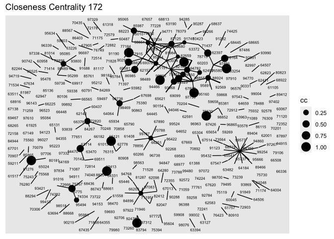

---
output:
  pdf_document: default
  html_document: default
---
ex3
================

## Load the data

``` r
library(arrow)
```

    ## Warning: package 'arrow' was built under R version 4.1.2

    ## 
    ## Attaching package: 'arrow'

    ## The following object is masked from 'package:utils':
    ## 
    ##     timestamp

``` r
df = read_parquet("~/Desktop/McGill/ORGB/2022-ona-assignments/ex3/app_data_sample.parquet")
```

## Predicting examiners’ gender based on first name:

The gender package attempts to infer gender (or more precisely, sex
assigned at birth) based on first names using historical data, typically
data that was gathered by the state.

``` r
library(gender)
library(dplyr)
```

    ## 
    ## Attaching package: 'dplyr'

    ## The following objects are masked from 'package:stats':
    ## 
    ##     filter, lag

    ## The following objects are masked from 'package:base':
    ## 
    ##     intersect, setdiff, setequal, union

``` r
first_name = df %>%distinct(examiner_name_first)
gender_probability = gender(first_name$examiner_name_first)
gender_dictionary = gender_probability %>% select(name,gender)
df <- df %>% left_join(gender_dictionary, by = c("examiner_name_first" = "name"))
head(df$gender)
```

    ## [1] "female" NA       "female" "female" "male"   "female"

The gender package assign gender based on historical data. Some of the
name is not in the data set, thus there are some missing gender
information. I filled those values by distribution.

``` r
table(is.na(df$gender))
```

    ## 
    ##   FALSE    TRUE 
    ## 1714618  303859

``` r
gender_na = is.na(df$gender)
gender_fill = sample(df$gender[!gender_na], size = sum(gender_na), replace = TRUE)
df$gender[is.na(df$gender)] <- gender_fill
table(is.na(df$gender))
```

    ## 
    ##   FALSE 
    ## 2018477

All the missing value has been filled.

## Predicting examiners’ race based on last name:

The “predictrace” package predict the race of a surname using U.S.
Census data which says how many people of each race has a certain
surname.

``` r
library(predictrace)
race = predict_race(df$examiner_name_last, probability = FALSE)
df$race = race$likely_race
head(df$race,10)
```

    ##  [1] "white" "white" "white" "white" "white" "white" "black" "white" NA     
    ## [10] "asian"

Again, fill the missing values based on distribution.

``` r
table(is.na(df$race))
```

    ## 
    ##   FALSE    TRUE 
    ## 1704131  314346

``` r
race_na = is.na(df$race)
race_fill = sample(df$race[!race_na], size = sum(race_na), replace = TRUE)
df$race[is.na(df$race)] <- race_fill
table(is.na(df$race))
```

    ## 
    ##   FALSE 
    ## 2018477

## Calculate Tenure

To calculate tenure, I need to calculate the time the application stay
in the system.

For most applications, the filing date is the date on which PTO received
the application.

The appl\_status\_date variable indicates the date that the application
entered its most recent status (or status as of the end of 2014).

``` r
tenure_info <- df %>% select(examiner_id, filing_date, appl_status_date)

library(lubridate)
```

    ## 
    ## Attaching package: 'lubridate'

    ## The following object is masked from 'package:arrow':
    ## 
    ##     duration

    ## The following objects are masked from 'package:base':
    ## 
    ##     date, intersect, setdiff, union

``` r
tenure_info = tenure_info %>% mutate(appl_status_date = as_date(dmy_hms(appl_status_date))) 
tenure_info$tenure_days = as.numeric(difftime(tenure_info$appl_status_date,tenure_info$filing_date,units="days"))

## detect missing values
table(is.na(tenure_info$tenure_days))
```

    ## 
    ##   FALSE    TRUE 
    ## 2013867    4610

``` r
## fill missing values
tenure_na = is.na(tenure_info$tenure_days)
tenure_fill = sample(tenure_info$tenure_days[!tenure_na], size = sum(tenure_na), replace = TRUE)
tenure_info$tenure_days[is.na(tenure_info$tenure_days)] <- tenure_fill
table(is.na(tenure_info$tenure_days))
```

    ## 
    ##   FALSE 
    ## 2018477

``` r
## join with df
df$tenure = tenure_info$tenure_days
```

## Pick two workgroup

The two group I pick is 1648 and 1722. 1600 – Biotechnology 1700 –
Chemical and Materials Engineering

``` r
wg = as.numeric(substr(df$examiner_art_unit, 1, 3))
df$wg = wg
group_164 = df %>% filter(df$wg == 164)
group_172 = df %>% filter(df$wg == 172)
```

### Examing Group 1648

``` r
## summary
table(group_164$gender)
```

    ## 
    ## female   male 
    ##  45839  47503

``` r
table(group_164$race)
```

    ## 
    ## american_indian           asian           black        hispanic           white 
    ##               2           24487            3974            1421           63458

### Examing Group 1722

``` r
## summary
table(group_172$gender)
```

    ## 
    ## female   male 
    ##  22865  56330

``` r
table(group_172$race)
```

    ## 
    ## american_indian           asian           black        hispanic           white 
    ##               4           18624            1065            2225           57277

``` r
two_group_gender <- t(cbind(table(group_164$gender), table(group_172$gender)))

barplot(two_group_gender, beside=T, col=c("red","blue")) 
par(xpd=T)
legend("top",legend = c("164","172"), fill=c("red","blue"), cex = 0.5)
```

<!-- -->
<!-- --><!-- -->
\#\# Create advice networks from edges-sample

``` r
library(tidyverse)
net = read_csv("~/Desktop/McGill/ORGB/2022-ona-assignments/ex3/edges_sample.csv")

edges_164 = inner_join(df %>% filter(wg == 164),net,by = c("application_number" = "application_number")) %>% select(ego_examiner_id,alter_examiner_id,examiner_art_unit)

colnames(edges_164) = c("from","to","art_unit")
edges_164 = drop_na(edges_164)

edges_172 = inner_join(df %>% filter(wg == 172),net,by = c("application_number" = "application_number")) %>% select(ego_examiner_id,alter_examiner_id,examiner_art_unit)

colnames(edges_172) = c("from","to","art_unit")
edges_172 = drop_na(edges_172)
```

### Create Nodes

``` r
edges = rbind(edges_164,edges_172)
node_ego = edges %>% select(from,art_unit) %>%rename(id=from) 
node_alter = edges %>% select(to,art_unit)%>%rename(id=to)
nodes_all <-rbind.data.frame(node_ego, node_alter)

nodes = nodes_all %>% distinct(id)

nodes = nodes %>% mutate(id = as.character(id))
```

### Create Graph

``` r
library(igraph)
```

    ## 
    ## Attaching package: 'igraph'

    ## The following objects are masked from 'package:purrr':
    ## 
    ##     compose, simplify

    ## The following object is masked from 'package:tidyr':
    ## 
    ##     crossing

    ## The following object is masked from 'package:tibble':
    ## 
    ##     as_data_frame

    ## The following objects are masked from 'package:lubridate':
    ## 
    ##     %--%, union

    ## The following objects are masked from 'package:dplyr':
    ## 
    ##     as_data_frame, groups, union

    ## The following objects are masked from 'package:stats':
    ## 
    ##     decompose, spectrum

    ## The following object is masked from 'package:base':
    ## 
    ##     union

``` r
net_164 = graph_from_data_frame(d=edges_164, vertices=nodes, directed=TRUE)
net_164
```

    ## IGRAPH abe8745 DN-- 382 1320 -- 
    ## + attr: name (v/c), art_unit (e/n)
    ## + edges from abe8745 (vertex names):
    ##  [1] 91688->71059 91688->67669 97910->59738 97910->99004 97910->67669
    ##  [6] 75775->69583 75775->83794 75775->70306 75775->91151 75775->71534
    ## [11] 70204->72882 70204->94911 71120->65790 59338->72882 61757->65024
    ## [16] 61757->72882 60067->91747 60067->71087 60067->73722 60067->81365
    ## [21] 96963->72882 97910->65790 97910->59738 97910->99004 93839->71946
    ## [26] 74224->65024 74224->94911 96963->67657 87897->69583 87897->72882
    ## [31] 75775->69583 75775->83794 75775->70306 93839->67669 93839->71946
    ## [36] 93839->67669 93839->95981 75775->69583 75775->69583 75775->69583
    ## + ... omitted several edges

``` r
net_172 = graph_from_data_frame(d=edges_172, vertices=nodes, directed=TRUE)
```

## Pick the mesure of centrality

1.  Degree centrality is defined as the number of links incident upon a
    node
2.  Eigenvector Centrality is an algorithm that measures the transitive
    influence of nodes. A high eigenvector score means that a node is
    connected to many nodes who themselves have high scores.
3.  Closeness centrality is a measure of the average shortest distance
    from each vertex to each other vertex
4.  Betweenness centrality is a way of detecting the amount of influence
    a node has over the flow of information in a graph.

``` r
## Degree Centrality
V(net_164)$dc <- degree(net_164)
V(net_172)$dc <- degree(net_172)

## Eigenvector Centrality
V(net_164)$ec <- evcent(net_164)$vector
V(net_172)$ec <- evcent(net_172)$vector

## Closeness Centrality
V(net_164)$cc <- closeness(net_164)
V(net_172)$cc <- closeness(net_172)

## Betweenness Centrality
V(net_164)$bc <- betweenness(net_164)
V(net_172)$bc <- betweenness(net_172)
```

## Plot the network based on centrality

``` r
library(ggraph)
library(ggplot2)
library(ggpubr)
# Degree Centrality
dc_164 = ggraph(net_164, layout="kk") +
  geom_edge_link()+
  geom_node_point(aes(size=dc), show.legend=T) + ggtitle("Degree Centrality 164")

# Eigenvector Centrality
ec_164<-ggraph(net_164, layout="kk") +
  geom_edge_link()+
  geom_node_point(aes(size=ec), show.legend=T) + ggtitle("Eigenvector Centrality 164")

# Closeness Centrality
cc_164<-ggraph(net_164, layout="kk") +
  geom_edge_link()+
  geom_node_point(aes(size=cc), show.legend=T) + ggtitle("Closeness Centrality 164")

# Betweenness Centrality
bc_164<-ggraph(net_164, layout="kk") +
  geom_edge_link()+
  geom_node_point(aes(size=bc), show.legend=T) + ggtitle("Betwenness Centrality 164")
```

## Centrality Scores

``` r
centrality_164 <- data.frame(
                             id = V(net_164)$name,
                         degree      = V(net_164)$dc,
                         closeness   = V(net_164)$cc,
                         betweenness = V(net_164)$bc,
                         eigenvector = V(net_164)$ec)
centrality_164
```

    ##        id degree  closeness betweenness  eigenvector
    ## 1   91688      2 0.50000000   0.0000000 7.440125e-04
    ## 2   97910    170 0.01098901   0.0000000 1.000000e+00
    ## 3   75775     74 0.05882353   0.0000000 5.289362e-02
    ## 4   70204     50 0.14285714   0.0000000 2.087178e-01
    ## 5   71120      1 1.00000000   0.0000000 7.229780e-04
    ## 6   59338     17 0.07142857   0.0000000 2.368914e-02
    ## 7   61757     15 0.12500000   0.0000000 4.667189e-02
    ## 8   60067     53 0.06250000   0.0000000 2.659651e-01
    ## 9   96963     25 0.12500000  26.5000000 3.052454e-02
    ## 10  93839     33 0.14285714   6.0000000 2.323823e-02
    ## 11  74224     62 0.12500000   0.0000000 2.960134e-02
    ## 12  87897     96 0.01694915   0.0000000 1.828619e-01
    ## 13  97706     22 1.00000000   0.0000000 0.000000e+00
    ## 14  95604     27 0.04347826   7.3000000 3.620639e-02
    ## 15  68665     14 0.14285714   0.0000000 2.936425e-02
    ## 16  59211     43 0.07692308  22.0000000 1.486958e-02
    ## 17  94046     28 0.03846154   0.0000000 1.094606e-02
    ## 18  98563     21 0.05555556   0.0000000 1.296573e-02
    ## 19  84944      2 0.50000000   0.0000000 0.000000e+00
    ## 20  64659     34 0.16666667   0.0000000 2.892049e-01
    ## 21  75380      3 0.33333333   0.0000000 8.545698e-03
    ## 22  71195      1 1.00000000   0.0000000 7.229780e-04
    ## 23  81117     22 0.14285714   0.0000000 3.273904e-03
    ## 24  96143     13 0.16666667   0.0000000 5.957523e-02
    ## 25  97543     13 0.12500000   0.0000000 1.508066e-02
    ## 26  84896      4 0.25000000   0.0000000 9.202491e-03
    ## 27  75730      8 0.25000000   0.0000000 2.255907e-03
    ## 28  62583     21 0.20000000   0.0000000 1.511536e-02
    ## 29  92784     23 0.33333333   0.0000000 5.269872e-03
    ## 30  75568     44 0.08333333   0.0000000 2.080392e-01
    ## 31  85865     22 0.50000000   0.0000000 4.173187e-03
    ## 32  68436      5 0.25000000   0.0000000 8.786725e-04
    ## 33  61276     21 0.12500000   2.0000000 9.847097e-02
    ## 34  85987     24 0.12500000   6.0000000 2.070885e-01
    ## 35  61048      1 1.00000000   0.0000000 7.438540e-04
    ## 36  93421     17 0.09090909   0.0000000 5.460819e-02
    ## 37  72241      7 0.20000000   0.0000000 2.305370e-02
    ## 38  68922      9 0.14285714   0.0000000 4.583718e-03
    ## 39  83794     29 0.50000000  16.0000000 3.148191e-02
    ## 40  63511     13 0.20000000   0.0000000 8.683155e-03
    ## 41  93869      4 0.16666667   0.0000000 1.535799e-02
    ## 42  59693      8 0.05263158   0.0000000 2.010957e-03
    ## 43  79980      2 0.50000000   0.0000000 4.869150e-04
    ## 44  71259     17 0.14285714   0.0000000 1.169589e-02
    ## 45  63470      5 0.50000000   0.0000000 1.068662e-03
    ## 46  64064      4 0.50000000   0.0000000 4.033194e-02
    ## 47  82047     57 0.04347826   7.6000000 3.348116e-02
    ## 48  62397     31 0.10000000   0.6666667 1.965911e-01
    ## 49  90331     11 0.09090909   1.1000000 5.266137e-02
    ## 50  71414     12 0.20000000   0.0000000 1.801370e-02
    ## 51  92572      9 0.12500000   5.0000000 2.442997e-02
    ## 52  61558      2 0.50000000   0.0000000 7.442756e-03
    ## 53  63394      5 0.04000000   0.0000000 8.039191e-04
    ## 54  66336      2 0.50000000   0.0000000 4.540176e-05
    ## 55  96523      5 0.20000000   0.0000000 3.425991e-04
    ## 56  65654      6 0.14285714   4.0000000 2.454711e-03
    ## 57  64507      4 1.00000000   2.3333333 2.927285e-02
    ## 58  59497      6 0.12500000   0.0000000 1.095277e-03
    ## 59  79495     10 0.14285714   0.0000000 3.255666e-02
    ## 60  73260     36 0.03030303   0.0000000 3.656860e-02
    ## 61  62001      1 1.00000000   0.0000000 4.844712e-04
    ## 62  98076      5 0.33333333   0.0000000 4.055511e-02
    ## 63  71437      2 1.00000000   0.0000000 6.046637e-04
    ## 64  64169      4 1.00000000   0.0000000 2.887833e-02
    ## 65  86115      6 0.25000000   0.0000000 8.494915e-03
    ## 66  59658      2 0.50000000   0.0000000 0.000000e+00
    ## 67  96027     10 0.50000000   0.0000000 3.629112e-02
    ## 68  71858      4 0.25000000   0.0000000 1.207964e-03
    ## 69  64445      1 1.00000000   0.0000000 1.237095e-03
    ## 70  73788      3 0.33333333   0.0000000 1.972022e-03
    ## 71  97772      5 0.33333333   0.0000000 1.763633e-02
    ## 72  68445      2 0.50000000   0.0000000 7.942560e-03
    ## 73  80908      3 0.50000000   0.0000000 0.000000e+00
    ## 74  97072      1 1.00000000   0.0000000 0.000000e+00
    ## 75  86403      1 1.00000000   0.0000000 0.000000e+00
    ## 76  84470      4 0.33333333   0.0000000 1.930838e-03
    ## 77  96576      1 1.00000000   0.0000000 6.705565e-06
    ## 78  64506      2 0.50000000   0.0000000 8.243366e-03
    ## 79  96388      3 0.50000000   0.0000000 3.218043e-03
    ## 80  76749     15 1.00000000   0.0000000 0.000000e+00
    ## 81  75243      4 0.25000000   0.0000000 0.000000e+00
    ## 82  90863     11 1.00000000   1.0000000 1.486915e-02
    ## 83  90219      9 0.33333333   1.5000000 1.114776e-02
    ## 84  94719      1 1.00000000   0.0000000 1.117014e-04
    ## 85  88223      1 1.00000000   0.0000000 5.127562e-05
    ## 86  98470      2 0.50000000   0.0000000 8.456677e-03
    ## 87  71089      1 1.00000000   0.0000000 7.438540e-04
    ## 88  74425      4 0.25000000   0.0000000 6.465110e-05
    ## 89  95634      3 0.08333333   0.0000000 8.122305e-05
    ## 90  97818      0        NaN   0.0000000 0.000000e+00
    ## 91  87125      0        NaN   0.0000000 0.000000e+00
    ## 92  97456      0        NaN   0.0000000 0.000000e+00
    ## 93  93968      0        NaN   0.0000000 0.000000e+00
    ## 94  62152      0        NaN   0.0000000 0.000000e+00
    ## 95  94782      0        NaN   0.0000000 0.000000e+00
    ## 96  67034      0        NaN   0.0000000 0.000000e+00
    ## 97  92108      0        NaN   0.0000000 0.000000e+00
    ## 98  91190      0        NaN   0.0000000 0.000000e+00
    ## 99  98469      0        NaN   0.0000000 0.000000e+00
    ## 100 95891      0        NaN   0.0000000 0.000000e+00
    ## 101 73898      0        NaN   0.0000000 0.000000e+00
    ## 102 59550      0        NaN   0.0000000 0.000000e+00
    ## 103 98855      0        NaN   0.0000000 0.000000e+00
    ## 104 97755      0        NaN   0.0000000 0.000000e+00
    ## 105 83034      0        NaN   0.0000000 0.000000e+00
    ## 106 62659      0        NaN   0.0000000 0.000000e+00
    ## 107 76580      0        NaN   0.0000000 0.000000e+00
    ## 108 75530      0        NaN   0.0000000 0.000000e+00
    ## 109 85323      0        NaN   0.0000000 0.000000e+00
    ## 110 74334      0        NaN   0.0000000 0.000000e+00
    ## 111 78715      0        NaN   0.0000000 0.000000e+00
    ## 112 94466      0        NaN   0.0000000 0.000000e+00
    ## 113 84267      0        NaN   0.0000000 0.000000e+00
    ## 114 92476      0        NaN   0.0000000 0.000000e+00
    ## 115 75367      0        NaN   0.0000000 0.000000e+00
    ## 116 65121      0        NaN   0.0000000 0.000000e+00
    ## 117 90290      0        NaN   0.0000000 0.000000e+00
    ## 118 66251      0        NaN   0.0000000 0.000000e+00
    ## 119 95010      0        NaN   0.0000000 0.000000e+00
    ## 120 63714      0        NaN   0.0000000 0.000000e+00
    ## 121 69581      0        NaN   0.0000000 0.000000e+00
    ## 122 86985      0        NaN   0.0000000 0.000000e+00
    ## 123 61517      0        NaN   0.0000000 0.000000e+00
    ## 124 69680      0        NaN   0.0000000 0.000000e+00
    ## 125 68719      0        NaN   0.0000000 0.000000e+00
    ## 126 62413      0        NaN   0.0000000 0.000000e+00
    ## 127 97083      0        NaN   0.0000000 0.000000e+00
    ## 128 71059      1        NaN   0.0000000 1.085728e-05
    ## 129 67669     33        NaN   0.0000000 5.097378e-02
    ## 130 59738     83        NaN   0.0000000 6.982489e-01
    ## 131 99004     82        NaN   0.0000000 6.836561e-01
    ## 132 69583     45        NaN   0.0000000 7.015643e-02
    ## 133 70306     11        NaN   0.0000000 8.490570e-03
    ## 134 91151      5        NaN   0.0000000 3.859350e-03
    ## 135 71534      5        NaN   0.0000000 3.859350e-03
    ## 136 72882    154        NaN   0.0000000 4.947334e-01
    ## 137 94911     47        NaN   0.0000000 5.922194e-02
    ## 138 65790     29        NaN   0.0000000 4.954321e-02
    ## 139 65024     65        NaN   0.0000000 2.618701e-02
    ## 140 91747      2        NaN   0.0000000 4.369782e-03
    ## 141 71087      7        NaN   0.0000000 1.123998e-02
    ## 142 73722      1        NaN   0.0000000 3.881195e-03
    ## 143 81365      1        NaN   0.0000000 3.881195e-03
    ## 144 71946     30        NaN   0.0000000 7.298222e-02
    ## 145 67657      2        NaN   0.0000000 8.908816e-04
    ## 146 95981      2        NaN   0.0000000 8.727535e-04
    ## 147 75119     22        NaN   0.0000000 0.000000e+00
    ## 148 70435      6        NaN   0.0000000 3.170132e-03
    ## 149 96738      3        NaN   0.0000000 1.529330e-02
    ## 150 64280     27        NaN   0.0000000 2.826566e-03
    ## 151 92578      3        NaN   0.0000000 1.227017e-03
    ## 152 99763      1        NaN   0.0000000 1.892073e-04
    ## 153 66266     61        NaN   0.0000000 8.477388e-02
    ## 154 68637      1        NaN   0.0000000 0.000000e+00
    ## 155 97834      1        NaN   0.0000000 0.000000e+00
    ## 156 85381     24        NaN   0.0000000 2.008683e-03
    ## 157 72903      3        NaN   0.0000000 2.608122e-03
    ## 158 99002      1        NaN   0.0000000 1.342908e-04
    ## 159 81987      3        NaN   0.0000000 1.327300e-04
    ## 160 99254     11        NaN   0.0000000 7.423058e-02
    ## 161 60423     11        NaN   0.0000000 7.423058e-02
    ## 162 67905      9        NaN   0.0000000 2.464362e-02
    ## 163 64652      9        NaN   0.0000000 2.464362e-02
    ## 164 83254     26        NaN   0.0000000 7.179617e-03
    ## 165 87486     18        NaN   0.0000000 7.654516e-03
    ## 166 88924      2        NaN   0.0000000 6.044032e-03
    ## 167 72178      2        NaN   0.0000000 6.044032e-03
    ## 168 72820      6        NaN   0.0000000 1.915633e-03
    ## 169 67149      1        NaN   0.0000000 3.035890e-03
    ## 170 61318      2        NaN   0.0000000 4.881891e-04
    ## 171 94285      1        NaN   0.0000000 1.459288e-02
    ## 172 63519      5        NaN   0.0000000 1.620961e-02
    ## 173 92569     16        NaN   0.0000000 2.071777e-02
    ## 174 65312      4        NaN   0.0000000 6.237938e-05
    ## 175 78488      1        NaN   0.0000000 1.267122e-04
    ## 176 90287      1        NaN   0.0000000 3.022016e-03
    ## 177 81014      1        NaN   0.0000000 3.022016e-03
    ## 178 63127      9        NaN   0.0000000 4.730153e-03
    ## 179 97470     13        NaN   0.0000000 5.868037e-03
    ## 180 99413     10        NaN   0.0000000 4.402277e-03
    ## 181 95212     10        NaN   0.0000000 4.402277e-03
    ## 182 67634     10        NaN   0.0000000 4.402277e-03
    ## 183 72579     10        NaN   0.0000000 4.402277e-03
    ## 184 82244      1        NaN   0.0000000 4.885864e-04
    ## 185 69917     27        NaN   0.0000000 1.619306e-01
    ## 186 88567      2        NaN   0.0000000 2.918575e-02
    ## 187 65446     28        NaN   0.0000000 6.449131e-02
    ## 188 71175      1        NaN   0.0000000 3.456927e-04
    ## 189 67426      1        NaN   0.0000000 3.456927e-04
    ## 190 63963      1        NaN   0.0000000 3.456927e-04
    ## 191 85136      2        NaN   0.0000000 3.024984e-03
    ## 192 72514      2        NaN   0.0000000 3.024984e-03
    ## 193 66508      2        NaN   0.0000000 3.024984e-03
    ## 194 70858      4        NaN   0.0000000 3.073559e-03
    ## 195 67701      3        NaN   0.0000000 3.766911e-05
    ## 196 63226      1        NaN   0.0000000 7.968905e-04
    ## 197 71828      1        NaN   0.0000000 3.364198e-04
    ## 198 76315      4        NaN   0.0000000 3.513743e-03
    ## 199 60958      2        NaN   0.0000000 7.878532e-04
    ## 200 63190      1        NaN   0.0000000 2.668480e-03
    ## 201 91232      2        NaN   0.0000000 1.536475e-02
    ## 202 72912     21        NaN   0.0000000 3.319916e-02
    ## 203 71174      1        NaN   0.0000000 4.285089e-04
    ## 204 84269      2        NaN   0.0000000 4.339800e-04
    ## 205 66378      2        NaN   0.0000000 5.345844e-04
    ## 206 66565      2        NaN   0.0000000 5.345844e-04
    ## 207 97329      2        NaN   0.0000000 5.345844e-04
    ## 208 70201      1        NaN   0.0000000 1.239652e-04
    ## 209 60487      2        NaN   0.0000000 7.762391e-03
    ## 210 74382      1        NaN   0.0000000 3.881195e-03
    ## 211 96339      6        NaN   0.0000000 3.790662e-03
    ## 212 72158      1        NaN   0.0000000 2.169900e-04
    ## 213 80106      5        NaN   0.0000000 3.856172e-03
    ## 214 90742      1        NaN   0.0000000 2.169900e-04
    ## 215 95085      1        NaN   0.0000000 0.000000e+00
    ## 216 62142      1        NaN   0.0000000 0.000000e+00
    ## 217 96865      5        NaN   0.0000000 2.647959e-03
    ## 218 59803      2        NaN   0.0000000 1.607651e-03
    ## 219 82997      1        NaN   0.0000000 6.688963e-05
    ## 220 88294      1        NaN   0.0000000 4.319686e-04
    ## 221 76280      1        NaN   0.0000000 1.239652e-04
    ## 222 62823      1        NaN   0.0000000 5.336410e-04
    ## 223 70907      1        NaN   0.0000000 0.000000e+00
    ## 224 72352      2        NaN   0.0000000 0.000000e+00
    ## 225 61013      1        NaN   0.0000000 4.285089e-04
    ## 226 95478      1        NaN   0.0000000 3.292017e-05
    ## 227 91016      1        NaN   0.0000000 3.456927e-04
    ## 228 97402      1        NaN   0.0000000 4.777568e-05
    ## 229 62947      2        NaN   0.0000000 1.296836e-03
    ## 230 67013      2        NaN   0.0000000 0.000000e+00
    ## 231 95784      1        NaN   0.0000000 3.035890e-03
    ## 232 85761      2        NaN   0.0000000 3.196648e-05
    ## 233 60045      3        NaN   0.0000000 4.377863e-02
    ## 234 70164      1        NaN   0.0000000 1.459288e-02
    ## 235 95084      3        NaN   0.0000000 4.377863e-02
    ## 236 95494      1        NaN   0.0000000 6.688963e-05
    ## 237 70079      1        NaN   0.0000000 6.688963e-05
    ## 238 90154      2        NaN   0.0000000 4.401405e-04
    ## 239 75394      2        NaN   0.0000000 7.762391e-03
    ## 240 62411      1        NaN   0.0000000 2.817648e-05
    ## 241 95223      2        NaN   0.0000000 4.595095e-04
    ## 242 61105      1        NaN   0.0000000 1.459288e-02
    ## 243 65131      1        NaN   0.0000000 1.459288e-02
    ## 244 70142      1        NaN   0.0000000 1.459288e-02
    ## 245 72355      1        NaN   0.0000000 4.319686e-04
    ## 246 72814      3        NaN   0.0000000 1.564959e-02
    ## 247 77761      2        NaN   0.0000000 8.908816e-04
    ## 248 67435      5        NaN   0.0000000 0.000000e+00
    ## 249 98700      2        NaN   0.0000000 3.413534e-04
    ## 250 67138      1        NaN   0.0000000 2.668480e-03
    ## 251 65737      1        NaN   0.0000000 1.762766e-05
    ## 252 93990      1        NaN   0.0000000 1.762766e-05
    ## 253 94153      1        NaN   0.0000000 0.000000e+00
    ## 254 93982      1        NaN   0.0000000 0.000000e+00
    ## 255 98518      1        NaN   0.0000000 0.000000e+00
    ## 256 64331      1        NaN   0.0000000 0.000000e+00
    ## 257 80823      1        NaN   0.0000000 2.668480e-03
    ## 258 88668      1        NaN   0.0000000 7.718700e-04
    ## 259 66225      1        NaN   0.0000000 2.668480e-03
    ## 260 60791      1        NaN   0.0000000 2.668480e-03
    ## 261 59908      1        NaN   0.0000000 2.668480e-03
    ## 262 76423      1        NaN   0.0000000 2.668480e-03
    ## 263 94770      1        NaN   0.0000000 2.668480e-03
    ## 264 76309      1        NaN   0.0000000 2.668480e-03
    ## 265 91849      1        NaN   0.0000000 2.668480e-03
    ## 266 69467      1        NaN   0.0000000 2.668480e-03
    ## 267 70892      1        NaN   0.0000000 2.668480e-03
    ## 268 97332      1        NaN   0.0000000 2.668480e-03
    ## 269 90288      1        NaN   0.0000000 2.668480e-03
    ## 270 86743      1        NaN   0.0000000 2.668480e-03
    ## 271 61388      1        NaN   0.0000000 2.668480e-03
    ## 272 95253      1        NaN   0.0000000 2.668480e-03
    ## 273 68813      1        NaN   0.0000000 2.668480e-03
    ## 274 97610      1        NaN   0.0000000 2.668480e-03
    ## 275 93800      1        NaN   0.0000000 2.668480e-03
    ## 276 94355      1        NaN   0.0000000 2.668480e-03
    ## 277 80910      1        NaN   0.0000000 2.668480e-03
    ## 278 60266      1        NaN   0.0000000 2.668480e-03
    ## 279 71528      1        NaN   0.0000000 2.668480e-03
    ## 280 59868      1        NaN   0.0000000 2.668480e-03
    ## 281 79106      1        NaN   0.0000000 2.668480e-03
    ## 282 64004      1        NaN   0.0000000 1.459288e-02
    ## 283 66448      1        NaN   0.0000000 2.668480e-03
    ## 284 93578      1        NaN   0.0000000 5.336410e-04
    ## 285 68916      1        NaN   0.0000000 5.336410e-04
    ## 286 99524      1        NaN   0.0000000 5.336410e-04
    ## 287 94123      1        NaN   0.0000000 5.336410e-04
    ## 288 88661      1        NaN   0.0000000 5.336410e-04
    ## 289 65304      1        NaN   0.0000000 5.336410e-04
    ## 290 89412      1        NaN   0.0000000 5.336410e-04
    ## 291 65541      1        NaN   0.0000000 5.336410e-04
    ## 292 75560      1        NaN   0.0000000 5.336410e-04
    ## 293 92268      1        NaN   0.0000000 2.668480e-03
    ## 294 63694      1        NaN   0.0000000 2.668480e-03
    ## 295 59258      1        NaN   0.0000000 2.668480e-03
    ## 296 99480      1        NaN   0.0000000 2.668480e-03
    ## 297 68265      1        NaN   0.0000000 2.668480e-03
    ## 298 62591      1        NaN   0.0000000 2.668480e-03
    ## 299 64355      2        NaN   0.0000000 2.295674e-04
    ## 300 98182      1        NaN   0.0000000 4.285089e-04
    ## 301 94915      1        NaN   0.0000000 4.750952e-04
    ## 302 95525      1        NaN   0.0000000 4.750952e-04
    ## 303 92706      1        NaN   0.0000000 2.668480e-03
    ## 304 94847      1        NaN   0.0000000 2.668480e-03
    ## 305 67620      1        NaN   0.0000000 2.668480e-03
    ## 306 99892      1        NaN   0.0000000 2.668480e-03
    ## 307 77063      2        NaN   0.0000000 1.056711e-03
    ## 308 61925      1        NaN   0.0000000 1.459288e-02
    ## 309 68977      1        NaN   0.0000000 1.459288e-02
    ## 310 73239      1        NaN   0.0000000 5.283554e-04
    ## 311 75932      1        NaN   0.0000000 2.628716e-04
    ## 312 69378      0        NaN   0.0000000 0.000000e+00
    ## 313 77915      0        NaN   0.0000000 0.000000e+00
    ## 314 61863      0        NaN   0.0000000 0.000000e+00
    ## 315 95344      0        NaN   0.0000000 0.000000e+00
    ## 316 78379      0        NaN   0.0000000 0.000000e+00
    ## 317 92991      0        NaN   0.0000000 0.000000e+00
    ## 318 62499      0        NaN   0.0000000 0.000000e+00
    ## 319 65621      0        NaN   0.0000000 0.000000e+00
    ## 320 75933      0        NaN   0.0000000 0.000000e+00
    ## 321 98489      0        NaN   0.0000000 0.000000e+00
    ## 322 60203      0        NaN   0.0000000 0.000000e+00
    ## 323 67829      0        NaN   0.0000000 0.000000e+00
    ## 324 60851      0        NaN   0.0000000 0.000000e+00
    ## 325 74052      0        NaN   0.0000000 0.000000e+00
    ## 326 98826      0        NaN   0.0000000 0.000000e+00
    ## 327 65934      0        NaN   0.0000000 0.000000e+00
    ## 328 97338      0        NaN   0.0000000 0.000000e+00
    ## 329 99489      0        NaN   0.0000000 0.000000e+00
    ## 330 95299      0        NaN   0.0000000 0.000000e+00
    ## 331 96697      0        NaN   0.0000000 0.000000e+00
    ## 332 69099      0        NaN   0.0000000 0.000000e+00
    ## 333 98852      0        NaN   0.0000000 0.000000e+00
    ## 334 90995      0        NaN   0.0000000 0.000000e+00
    ## 335 70248      0        NaN   0.0000000 0.000000e+00
    ## 336 77651      0        NaN   0.0000000 0.000000e+00
    ## 337 77184      0        NaN   0.0000000 0.000000e+00
    ## 338 97312      0        NaN   0.0000000 0.000000e+00
    ## 339 72666      0        NaN   0.0000000 0.000000e+00
    ## 340 74048      0        NaN   0.0000000 0.000000e+00
    ## 341 62778      0        NaN   0.0000000 0.000000e+00
    ## 342 78856      0        NaN   0.0000000 0.000000e+00
    ## 343 67890      0        NaN   0.0000000 0.000000e+00
    ## 344 61408      0        NaN   0.0000000 0.000000e+00
    ## 345 99787      0        NaN   0.0000000 0.000000e+00
    ## 346 86422      0        NaN   0.0000000 0.000000e+00
    ## 347 70788      0        NaN   0.0000000 0.000000e+00
    ## 348 77228      0        NaN   0.0000000 0.000000e+00
    ## 349 69511      0        NaN   0.0000000 0.000000e+00
    ## 350 66182      0        NaN   0.0000000 0.000000e+00
    ## 351 71397      0        NaN   0.0000000 0.000000e+00
    ## 352 95065      0        NaN   0.0000000 0.000000e+00
    ## 353 81984      0        NaN   0.0000000 0.000000e+00
    ## 354 60437      0        NaN   0.0000000 0.000000e+00
    ## 355 80181      0        NaN   0.0000000 0.000000e+00
    ## 356 67698      0        NaN   0.0000000 0.000000e+00
    ## 357 95160      0        NaN   0.0000000 0.000000e+00
    ## 358 94771      0        NaN   0.0000000 0.000000e+00
    ## 359 98738      0        NaN   0.0000000 0.000000e+00
    ## 360 63372      0        NaN   0.0000000 0.000000e+00
    ## 361 95432      0        NaN   0.0000000 0.000000e+00
    ## 362 59269      0        NaN   0.0000000 0.000000e+00
    ## 363 63482      0        NaN   0.0000000 0.000000e+00
    ## 364 94860      0        NaN   0.0000000 0.000000e+00
    ## 365 89466      0        NaN   0.0000000 0.000000e+00
    ## 366 95666      0        NaN   0.0000000 0.000000e+00
    ## 367 89404      0        NaN   0.0000000 0.000000e+00
    ## 368 73564      0        NaN   0.0000000 0.000000e+00
    ## 369 64184      0        NaN   0.0000000 0.000000e+00
    ## 370 67547      0        NaN   0.0000000 0.000000e+00
    ## 371 67514      0        NaN   0.0000000 0.000000e+00
    ## 372 97267      0        NaN   0.0000000 0.000000e+00
    ## 373 64350      0        NaN   0.0000000 0.000000e+00
    ## 374 99577      0        NaN   0.0000000 0.000000e+00
    ## 375 91123      0        NaN   0.0000000 0.000000e+00
    ## 376 88204      0        NaN   0.0000000 0.000000e+00
    ## 377 97922      0        NaN   0.0000000 0.000000e+00
    ## 378 94768      0        NaN   0.0000000 0.000000e+00
    ## 379 81287      0        NaN   0.0000000 0.000000e+00
    ## 380 66203      0        NaN   0.0000000 0.000000e+00
    ## 381 82412      0        NaN   0.0000000 0.000000e+00
    ## 382 62098      0        NaN   0.0000000 0.000000e+00

``` r
centrality_172 <- data.frame(id = V(net_164)$name,
                         degree      = V(net_172)$dc,
                         closeness   = V(net_172)$cc,
                         betweenness = V(net_172)$bc,
                         eigenvector = V(net_172)$ec)
centrality_172
```

    ##        id degree  closeness betweenness  eigenvector
    ## 1   91688      0        NaN           0 4.356715e-17
    ## 2   97910      0        NaN           0 4.356715e-17
    ## 3   75775      0        NaN           0 4.356715e-17
    ## 4   70204      0        NaN           0 4.356715e-17
    ## 5   71120      0        NaN           0 4.356715e-17
    ## 6   59338      0        NaN           0 4.356715e-17
    ## 7   61757      0        NaN           0 4.356715e-17
    ## 8   60067      0        NaN           0 4.356715e-17
    ## 9   96963      0        NaN           0 4.356715e-17
    ## 10  93839      0        NaN           0 4.356715e-17
    ## 11  74224      0        NaN           0 4.356715e-17
    ## 12  87897      0        NaN           0 4.356715e-17
    ## 13  97706      0        NaN           0 4.356715e-17
    ## 14  95604      0        NaN           0 4.356715e-17
    ## 15  68665      0        NaN           0 4.356715e-17
    ## 16  59211      0        NaN           0 4.356715e-17
    ## 17  94046      0        NaN           0 4.356715e-17
    ## 18  98563      0        NaN           0 4.356715e-17
    ## 19  84944      0        NaN           0 4.356715e-17
    ## 20  64659      0        NaN           0 4.356715e-17
    ## 21  75380      0        NaN           0 4.356715e-17
    ## 22  71195      0        NaN           0 4.356715e-17
    ## 23  81117      0        NaN           0 4.356715e-17
    ## 24  96143      0        NaN           0 4.356715e-17
    ## 25  97543      0        NaN           0 4.356715e-17
    ## 26  84896      0        NaN           0 4.356715e-17
    ## 27  75730      0        NaN           0 4.356715e-17
    ## 28  62583      0        NaN           0 4.356715e-17
    ## 29  92784      0        NaN           0 4.356715e-17
    ## 30  75568      0        NaN           0 4.356715e-17
    ## 31  85865      0        NaN           0 4.356715e-17
    ## 32  68436      0        NaN           0 4.356715e-17
    ## 33  61276      0        NaN           0 4.356715e-17
    ## 34  85987      0        NaN           0 4.356715e-17
    ## 35  61048      0        NaN           0 4.356715e-17
    ## 36  93421      0        NaN           0 4.356715e-17
    ## 37  72241      0        NaN           0 4.356715e-17
    ## 38  68922      0        NaN           0 4.356715e-17
    ## 39  83794      0        NaN           0 4.356715e-17
    ## 40  63511      0        NaN           0 4.356715e-17
    ## 41  93869      0        NaN           0 4.356715e-17
    ## 42  59693      0        NaN           0 4.356715e-17
    ## 43  79980      0        NaN           0 4.356715e-17
    ## 44  71259      0        NaN           0 4.356715e-17
    ## 45  63470      0        NaN           0 4.356715e-17
    ## 46  64064      0        NaN           0 4.356715e-17
    ## 47  82047      0        NaN           0 4.356715e-17
    ## 48  62397      0        NaN           0 4.356715e-17
    ## 49  90331      0        NaN           0 4.356715e-17
    ## 50  71414      0        NaN           0 4.356715e-17
    ## 51  92572      0        NaN           0 4.356715e-17
    ## 52  61558      0        NaN           0 4.356715e-17
    ## 53  63394      0        NaN           0 4.356715e-17
    ## 54  66336      0        NaN           0 4.356715e-17
    ## 55  96523      0        NaN           0 4.356715e-17
    ## 56  65654      0        NaN           0 4.356715e-17
    ## 57  64507      0        NaN           0 4.356715e-17
    ## 58  59497      0        NaN           0 4.356715e-17
    ## 59  79495      0        NaN           0 4.356715e-17
    ## 60  73260      0        NaN           0 4.356715e-17
    ## 61  62001      0        NaN           0 4.356715e-17
    ## 62  98076      0        NaN           0 4.356715e-17
    ## 63  71437      0        NaN           0 4.356715e-17
    ## 64  64169      0        NaN           0 4.356715e-17
    ## 65  86115      0        NaN           0 4.356715e-17
    ## 66  59658      0        NaN           0 4.356715e-17
    ## 67  96027      0        NaN           0 4.356715e-17
    ## 68  71858      0        NaN           0 4.356715e-17
    ## 69  64445      0        NaN           0 4.356715e-17
    ## 70  73788      0        NaN           0 4.356715e-17
    ## 71  97772      0        NaN           0 4.356715e-17
    ## 72  68445      0        NaN           0 4.356715e-17
    ## 73  80908      0        NaN           0 4.356715e-17
    ## 74  97072      0        NaN           0 4.356715e-17
    ## 75  86403      0        NaN           0 4.356715e-17
    ## 76  84470      0        NaN           0 4.356715e-17
    ## 77  96576      0        NaN           0 4.356715e-17
    ## 78  64506      0        NaN           0 4.356715e-17
    ## 79  96388      0        NaN           0 4.356715e-17
    ## 80  76749      0        NaN           0 4.356715e-17
    ## 81  75243      0        NaN           0 4.356715e-17
    ## 82  90863      0        NaN           0 4.356715e-17
    ## 83  90219      0        NaN           0 4.356715e-17
    ## 84  94719      0        NaN           0 4.356715e-17
    ## 85  88223      0        NaN           0 4.356715e-17
    ## 86  98470      0        NaN           0 4.356715e-17
    ## 87  71089      0        NaN           0 4.356715e-17
    ## 88  74425      0        NaN           0 4.356715e-17
    ## 89  95634      0        NaN           0 4.356715e-17
    ## 90  97818      7 0.16666667           0 1.603375e-02
    ## 91  87125      8 0.33333333          12 6.224787e-02
    ## 92  97456      4 0.50000000           0 1.955749e-06
    ## 93  93968     11 0.33333333           0 9.513752e-04
    ## 94  62152     12 0.16666667           0 3.004243e-02
    ## 95  94782     19 0.33333333           2 1.359346e-03
    ## 96  67034     31 0.07142857           0 1.000000e+00
    ## 97  92108      1 1.00000000           0 2.287811e-04
    ## 98  91190      6        NaN           0 1.753895e-17
    ## 99  98469      3 0.33333333           0 1.150516e-16
    ## 100 95891     12 0.25000000           0 7.014774e-05
    ## 101 73898      4 0.25000000           0 1.515138e-16
    ## 102 59550      6 0.25000000           0 4.649829e-04
    ## 103 98855      2 0.16666667           0 1.328568e-04
    ## 104 97755      1 1.00000000           0 5.318553e-05
    ## 105 83034      6 0.05555556           0 1.482297e-02
    ## 106 62659     11 0.11111111           5 7.788714e-03
    ## 107 76580      1 1.00000000           0 6.496768e-07
    ## 108 75530      1 1.00000000           0 3.519392e-17
    ## 109 85323      3 0.50000000           0 5.107478e-04
    ## 110 74334      1 0.20000000           0 2.407413e-17
    ## 111 78715      4 0.50000000           0 4.231461e-05
    ## 112 94466      1 1.00000000           0 2.287811e-04
    ## 113 84267      3 0.33333333           0 1.105879e-16
    ## 114 92476      1 1.00000000           0 3.556291e-17
    ## 115 75367      3 0.50000000           2 1.149087e-16
    ## 116 65121      1 1.00000000           0 3.722526e-17
    ## 117 90290      1 1.00000000           0 4.096747e-03
    ## 118 66251      6 0.16666667           0 2.248197e-16
    ## 119 95010      5 0.33333333           0 1.392886e-01
    ## 120 63714      2 0.50000000           0 6.767847e-17
    ## 121 69581      2 0.50000000           0 4.125087e-03
    ## 122 86985      2 0.50000000           0 4.125087e-03
    ## 123 61517      1 1.00000000           0 3.824385e-17
    ## 124 69680      3 0.11111111           0 1.064280e-02
    ## 125 68719     15 0.06666667           0 6.341172e-16
    ## 126 62413      1 1.00000000           0 3.917222e-17
    ## 127 97083      6 0.16666667           0 2.315594e-16
    ## 128 71059      0        NaN           0 4.356715e-17
    ## 129 67669      0        NaN           0 4.356715e-17
    ## 130 59738      0        NaN           0 4.356715e-17
    ## 131 99004      0        NaN           0 4.356715e-17
    ## 132 69583      0        NaN           0 4.356715e-17
    ## 133 70306      0        NaN           0 4.356715e-17
    ## 134 91151      0        NaN           0 4.356715e-17
    ## 135 71534      0        NaN           0 4.356715e-17
    ## 136 72882      0        NaN           0 4.356715e-17
    ## 137 94911      0        NaN           0 4.356715e-17
    ## 138 65790      0        NaN           0 4.356715e-17
    ## 139 65024      0        NaN           0 4.356715e-17
    ## 140 91747      0        NaN           0 4.356715e-17
    ## 141 71087      0        NaN           0 4.356715e-17
    ## 142 73722      0        NaN           0 4.356715e-17
    ## 143 81365      0        NaN           0 4.356715e-17
    ## 144 71946      0        NaN           0 4.356715e-17
    ## 145 67657      0        NaN           0 4.356715e-17
    ## 146 95981      0        NaN           0 4.356715e-17
    ## 147 75119      0        NaN           0 4.356715e-17
    ## 148 70435      0        NaN           0 4.356715e-17
    ## 149 96738      0        NaN           0 4.356715e-17
    ## 150 64280      0        NaN           0 4.356715e-17
    ## 151 92578      0        NaN           0 4.356715e-17
    ## 152 99763      0        NaN           0 4.356715e-17
    ## 153 66266      0        NaN           0 4.356715e-17
    ## 154 68637      0        NaN           0 4.356715e-17
    ## 155 97834      0        NaN           0 4.356715e-17
    ## 156 85381      0        NaN           0 4.356715e-17
    ## 157 72903      0        NaN           0 4.356715e-17
    ## 158 99002      0        NaN           0 4.356715e-17
    ## 159 81987      0        NaN           0 4.356715e-17
    ## 160 99254      0        NaN           0 4.356715e-17
    ## 161 60423      0        NaN           0 4.356715e-17
    ## 162 67905      0        NaN           0 4.356715e-17
    ## 163 64652      0        NaN           0 4.356715e-17
    ## 164 83254      0        NaN           0 4.356715e-17
    ## 165 87486      0        NaN           0 4.356715e-17
    ## 166 88924      0        NaN           0 4.356715e-17
    ## 167 72178      0        NaN           0 4.356715e-17
    ## 168 72820      0        NaN           0 4.356715e-17
    ## 169 67149      0        NaN           0 4.356715e-17
    ## 170 61318      0        NaN           0 4.356715e-17
    ## 171 94285      0        NaN           0 4.356715e-17
    ## 172 63519      0        NaN           0 4.356715e-17
    ## 173 92569      8        NaN           0 3.289088e-05
    ## 174 65312      0        NaN           0 4.356715e-17
    ## 175 78488      0        NaN           0 4.356715e-17
    ## 176 90287      0        NaN           0 4.356715e-17
    ## 177 81014      0        NaN           0 4.356715e-17
    ## 178 63127      0        NaN           0 4.356715e-17
    ## 179 97470      0        NaN           0 4.356715e-17
    ## 180 99413      0        NaN           0 4.356715e-17
    ## 181 95212      0        NaN           0 4.356715e-17
    ## 182 67634      0        NaN           0 4.356715e-17
    ## 183 72579      0        NaN           0 4.356715e-17
    ## 184 82244      0        NaN           0 4.356715e-17
    ## 185 69917      0        NaN           0 4.356715e-17
    ## 186 88567      0        NaN           0 4.356715e-17
    ## 187 65446      0        NaN           0 4.356715e-17
    ## 188 71175      0        NaN           0 4.356715e-17
    ## 189 67426      0        NaN           0 4.356715e-17
    ## 190 63963      0        NaN           0 4.356715e-17
    ## 191 85136      0        NaN           0 4.356715e-17
    ## 192 72514      0        NaN           0 4.356715e-17
    ## 193 66508      0        NaN           0 4.356715e-17
    ## 194 70858      0        NaN           0 4.356715e-17
    ## 195 67701      0        NaN           0 4.356715e-17
    ## 196 63226      0        NaN           0 4.356715e-17
    ## 197 71828      0        NaN           0 4.356715e-17
    ## 198 76315      0        NaN           0 4.356715e-17
    ## 199 60958      0        NaN           0 4.356715e-17
    ## 200 63190      0        NaN           0 4.356715e-17
    ## 201 91232      0        NaN           0 4.356715e-17
    ## 202 72912      0        NaN           0 4.356715e-17
    ## 203 71174      0        NaN           0 4.356715e-17
    ## 204 84269      0        NaN           0 4.356715e-17
    ## 205 66378      0        NaN           0 4.356715e-17
    ## 206 66565      0        NaN           0 4.356715e-17
    ## 207 97329      0        NaN           0 4.356715e-17
    ## 208 70201      0        NaN           0 4.356715e-17
    ## 209 60487      0        NaN           0 4.356715e-17
    ## 210 74382      0        NaN           0 4.356715e-17
    ## 211 96339      0        NaN           0 4.356715e-17
    ## 212 72158      0        NaN           0 4.356715e-17
    ## 213 80106      0        NaN           0 4.356715e-17
    ## 214 90742      0        NaN           0 4.356715e-17
    ## 215 95085      0        NaN           0 4.356715e-17
    ## 216 62142      0        NaN           0 4.356715e-17
    ## 217 96865      0        NaN           0 4.356715e-17
    ## 218 59803      0        NaN           0 4.356715e-17
    ## 219 82997      0        NaN           0 4.356715e-17
    ## 220 88294      0        NaN           0 4.356715e-17
    ## 221 76280      0        NaN           0 4.356715e-17
    ## 222 62823      0        NaN           0 4.356715e-17
    ## 223 70907      0        NaN           0 4.356715e-17
    ## 224 72352      0        NaN           0 4.356715e-17
    ## 225 61013      0        NaN           0 4.356715e-17
    ## 226 95478      0        NaN           0 4.356715e-17
    ## 227 91016      0        NaN           0 4.356715e-17
    ## 228 97402      0        NaN           0 4.356715e-17
    ## 229 62947      0        NaN           0 4.356715e-17
    ## 230 67013      0        NaN           0 4.356715e-17
    ## 231 95784      0        NaN           0 4.356715e-17
    ## 232 85761      0        NaN           0 4.356715e-17
    ## 233 60045      0        NaN           0 4.356715e-17
    ## 234 70164      0        NaN           0 4.356715e-17
    ## 235 95084      0        NaN           0 4.356715e-17
    ## 236 95494      0        NaN           0 4.356715e-17
    ## 237 70079      0        NaN           0 4.356715e-17
    ## 238 90154      0        NaN           0 4.356715e-17
    ## 239 75394      0        NaN           0 4.356715e-17
    ## 240 62411      0        NaN           0 4.356715e-17
    ## 241 95223      0        NaN           0 4.356715e-17
    ## 242 61105      0        NaN           0 4.356715e-17
    ## 243 65131      0        NaN           0 4.356715e-17
    ## 244 70142      0        NaN           0 4.356715e-17
    ## 245 72355      0        NaN           0 4.356715e-17
    ## 246 72814      0        NaN           0 4.356715e-17
    ## 247 77761      0        NaN           0 4.356715e-17
    ## 248 67435      0        NaN           0 4.356715e-17
    ## 249 98700      0        NaN           0 4.356715e-17
    ## 250 67138      0        NaN           0 4.356715e-17
    ## 251 65737      0        NaN           0 4.356715e-17
    ## 252 93990      0        NaN           0 4.356715e-17
    ## 253 94153      0        NaN           0 4.356715e-17
    ## 254 93982      0        NaN           0 4.356715e-17
    ## 255 98518      0        NaN           0 4.356715e-17
    ## 256 64331      0        NaN           0 4.356715e-17
    ## 257 80823      0        NaN           0 4.356715e-17
    ## 258 88668      0        NaN           0 4.356715e-17
    ## 259 66225      0        NaN           0 4.356715e-17
    ## 260 60791      0        NaN           0 4.356715e-17
    ## 261 59908      0        NaN           0 4.356715e-17
    ## 262 76423      0        NaN           0 4.356715e-17
    ## 263 94770      0        NaN           0 4.356715e-17
    ## 264 76309      0        NaN           0 4.356715e-17
    ## 265 91849      0        NaN           0 4.356715e-17
    ## 266 69467      0        NaN           0 4.356715e-17
    ## 267 70892      0        NaN           0 4.356715e-17
    ## 268 97332      0        NaN           0 4.356715e-17
    ## 269 90288      0        NaN           0 4.356715e-17
    ## 270 86743      0        NaN           0 4.356715e-17
    ## 271 61388      0        NaN           0 4.356715e-17
    ## 272 95253      0        NaN           0 4.356715e-17
    ## 273 68813      0        NaN           0 4.356715e-17
    ## 274 97610      0        NaN           0 4.356715e-17
    ## 275 93800      0        NaN           0 4.356715e-17
    ## 276 94355      0        NaN           0 4.356715e-17
    ## 277 80910      0        NaN           0 4.356715e-17
    ## 278 60266      0        NaN           0 4.356715e-17
    ## 279 71528      0        NaN           0 4.356715e-17
    ## 280 59868      0        NaN           0 4.356715e-17
    ## 281 79106      0        NaN           0 4.356715e-17
    ## 282 64004      0        NaN           0 4.356715e-17
    ## 283 66448      0        NaN           0 4.356715e-17
    ## 284 93578      0        NaN           0 4.356715e-17
    ## 285 68916      0        NaN           0 4.356715e-17
    ## 286 99524      0        NaN           0 4.356715e-17
    ## 287 94123      0        NaN           0 4.356715e-17
    ## 288 88661      0        NaN           0 4.356715e-17
    ## 289 65304      0        NaN           0 4.356715e-17
    ## 290 89412      0        NaN           0 4.356715e-17
    ## 291 65541      0        NaN           0 4.356715e-17
    ## 292 75560      0        NaN           0 4.356715e-17
    ## 293 92268      0        NaN           0 4.356715e-17
    ## 294 63694      0        NaN           0 4.356715e-17
    ## 295 59258      0        NaN           0 4.356715e-17
    ## 296 99480      0        NaN           0 4.356715e-17
    ## 297 68265      0        NaN           0 4.356715e-17
    ## 298 62591      0        NaN           0 4.356715e-17
    ## 299 64355      0        NaN           0 4.356715e-17
    ## 300 98182      0        NaN           0 4.356715e-17
    ## 301 94915      0        NaN           0 4.356715e-17
    ## 302 95525      0        NaN           0 4.356715e-17
    ## 303 92706      0        NaN           0 4.356715e-17
    ## 304 94847      0        NaN           0 4.356715e-17
    ## 305 67620      0        NaN           0 4.356715e-17
    ## 306 99892      0        NaN           0 4.356715e-17
    ## 307 77063      0        NaN           0 4.356715e-17
    ## 308 61925      0        NaN           0 4.356715e-17
    ## 309 68977      0        NaN           0 4.356715e-17
    ## 310 73239      0        NaN           0 4.356715e-17
    ## 311 75932      0        NaN           0 4.356715e-17
    ## 312 69378      4        NaN           0 1.190286e-01
    ## 313 77915      4        NaN           0 6.225029e-02
    ## 314 61863      4        NaN           0 9.997225e-03
    ## 315 95344      4        NaN           0 9.997225e-03
    ## 316 78379      1        NaN           0 3.648349e-03
    ## 317 92991      1        NaN           0 1.146265e-07
    ## 318 62499      7        NaN           0 1.108474e-05
    ## 319 65621      4        NaN           0 2.230405e-04
    ## 320 75933     13        NaN           0 3.903447e-03
    ## 321 98489      2        NaN           0 3.521575e-03
    ## 322 60203     12        NaN           0 1.280462e-03
    ## 323 67829     18        NaN           0 9.074478e-04
    ## 324 60851      6        NaN           0 3.516601e-01
    ## 325 74052     16        NaN           0 7.864214e-01
    ## 326 98826     10        NaN           0 6.989840e-02
    ## 327 65934      1        NaN           0 2.684046e-17
    ## 328 97338      1        NaN           0 2.062738e-17
    ## 329 99489      1        NaN           0 1.957038e-17
    ## 330 95299      1        NaN           0 2.194952e-17
    ## 331 96697      1        NaN           0 2.079526e-17
    ## 332 69099      1        NaN           0 2.725266e-05
    ## 333 98852      1        NaN           0 3.601754e-17
    ## 334 90995      2        NaN           0 1.737549e-03
    ## 335 70248      1        NaN           0 2.439549e-17
    ## 336 77651      1        NaN           0 2.621432e-17
    ## 337 77184      2        NaN           0 9.103444e-03
    ## 338 97312      1        NaN           0 3.762031e-17
    ## 339 72666      1        NaN           0 2.611942e-17
    ## 340 74048      1        NaN           0 2.645324e-17
    ## 341 62778      1        NaN           0 3.552328e-17
    ## 342 78856      1        NaN           0 5.152493e-18
    ## 343 67890      1        NaN           0 7.143847e-18
    ## 344 61408      1        NaN           0 6.310605e-18
    ## 345 99787      1        NaN           0 6.960912e-18
    ## 346 86422      1        NaN           0 3.914374e-18
    ## 347 70788      1        NaN           0 5.802374e-18
    ## 348 77228      1        NaN           0 9.397387e-04
    ## 349 69511      1        NaN           0 3.219770e-17
    ## 350 66182      1        NaN           0 2.820059e-17
    ## 351 71397      2        NaN           0 4.835429e-04
    ## 352 95065      1        NaN           0 8.163706e-03
    ## 353 81984      4        NaN           0 1.187126e-01
    ## 354 60437      1        NaN           0 2.483594e-17
    ## 355 80181      1        NaN           0 3.896146e-17
    ## 356 67698      1        NaN           0 2.724826e-17
    ## 357 95160      1        NaN           0 4.111361e-06
    ## 358 94771      1        NaN           0 5.861002e-02
    ## 359 98738      1        NaN           0 2.178643e-17
    ## 360 63372      2        NaN           0 6.262549e-04
    ## 361 95432      1        NaN           0 0.000000e+00
    ## 362 59269      1        NaN           0 0.000000e+00
    ## 363 63482      1        NaN           0 0.000000e+00
    ## 364 94860      1        NaN           0 0.000000e+00
    ## 365 89466      1        NaN           0 0.000000e+00
    ## 366 95666      1        NaN           0 0.000000e+00
    ## 367 89404      1        NaN           0 0.000000e+00
    ## 368 73564      1        NaN           0 0.000000e+00
    ## 369 64184      1        NaN           0 0.000000e+00
    ## 370 67547      1        NaN           0 0.000000e+00
    ## 371 67514      1        NaN           0 0.000000e+00
    ## 372 97267      1        NaN           0 0.000000e+00
    ## 373 64350      1        NaN           0 0.000000e+00
    ## 374 99577      1        NaN           0 0.000000e+00
    ## 375 91123      1        NaN           0 0.000000e+00
    ## 376 88204      1        NaN           0 3.959135e-17
    ## 377 97922      1        NaN           0 7.108826e-18
    ## 378 94768      1        NaN           0 8.995829e-18
    ## 379 81287      1        NaN           0 7.257309e-18
    ## 380 66203      1        NaN           0 6.032715e-18
    ## 381 82412      1        NaN           0 6.353455e-18
    ## 382 62098      1        NaN           0 9.621650e-18

``` r
ggarrange(dc_164,ec_164,cc_164,bc_164,ncol = 2, nrow = 2)
```

    ## Warning: Removed 293 rows containing missing values (geom_point).

<!-- -->

``` r
dc_172 = ggraph(net_172, layout="kk") +
  geom_edge_link()+
  geom_node_point(aes(size=dc), show.legend=T) + ggtitle("Degree Centrality 172")

# Eigenvector Centrality
ec_172<-ggraph(net_172, layout="kk") +
  geom_edge_link()+
  geom_node_point(aes(size=ec), show.legend=T) + ggtitle("Eigenvector Centrality 172")

# Closness Centrality
cc_172<-ggraph(net_172, layout="kk") +
  geom_edge_link()+
  geom_node_point(aes(size=cc), show.legend=T) + ggtitle("Closeness Centrality 172")

# Betwenness Centrality
bc_172<-ggraph(net_172, layout="kk") +
  geom_edge_link()+
  geom_node_point(aes(size=bc), show.legend=T) + ggtitle("Betweenness Centrality 172")
```

``` r
ggarrange(dc_172,ec_172,cc_172,bc_172,ncol = 2, nrow = 2)
```

    ## Warning: Removed 345 rows containing missing values (geom_point).

<!-- -->

Based on the graph, seems like closeness centrality has clearer cluster
center.

## Characterize and discuss the relationship between centrality and other examiners’characteristics

``` r
ggraph(net_164, layout="kk") +
  geom_edge_link()+
  geom_node_point(aes(size=cc), show.legend=T) +geom_node_text(aes(label = centrality_164$id), repel=TRUE, size=2)+ ggtitle("Closeness Centrality 164")
```

    ## Warning: Removed 293 rows containing missing values (geom_point).

    ## Warning: ggrepel: 226 unlabeled data points (too many overlaps). Consider
    ## increasing max.overlaps

<!-- -->

``` r
ggraph(net_172, layout="kk") +
  geom_edge_link()+
  geom_node_point(aes(size=cc), show.legend=T) +geom_node_text(aes(label = centrality_172$id), repel=TRUE, size=2)+ ggtitle("Closeness Centrality 172")
```

    ## Warning: Removed 345 rows containing missing values (geom_point).

    ## Warning: ggrepel: 7 unlabeled data points (too many overlaps). Consider
    ## increasing max.overlaps

<!-- --> \#\#\# Gather
all examiner characteristics

``` r
examiner = df %>% select(examiner_id,examiner_art_unit,gender,race,tenure)
examiner = distinct(examiner)
```

### Examiner that are in group 164 and has the highest closeness centrality

``` r
max_cc_164 = max(centrality_164$closeness[!is.na(centrality_164$closeness)])
max_cc_164_id = centrality_164 %>% filter(centrality_164$closeness ==max_cc_164) %>%select(id)
max_cc_164_id = max_cc_164_id %>% mutate(id = as.numeric(id))
max_cc_164_info = examiner %>%filter(examiner_id == max_cc_164_id$id)

table(max_cc_164_info$gender)
```

    ## 
    ## female   male 
    ##    252    323

``` r
table(max_cc_164_info$race)
```

    ## 
    ##    asian    black hispanic    white 
    ##      163       43        2      367

Examiners that has higher closeness centrality in group 164, are more
likely to be while male.

### Examiner that are in group 172 and has the highest closeness centrality

``` r
max_cc_172 = max(centrality_172$closeness[!is.na(centrality_172$closeness)])
max_cc_172_id = centrality_172 %>% filter(centrality_172$closeness ==max_cc_172) %>%select(id)
max_cc_172_id = max_cc_172_id %>% mutate(id = as.numeric(id))
max_cc_172_info = examiner %>%filter(examiner_id == max_cc_172_id$id)

table(max_cc_172_info$gender)
```

    ## 
    ## female   male 
    ##     79    366

``` r
table(max_cc_172_info$race)
```

    ## 
    ##    asian hispanic    white 
    ##       63       43      339

The examiners that has higher closeness centrality in group 172 are
mostly male comparing to group 164. Also, there are more Hispanic
examiners that are influencial in this group.
