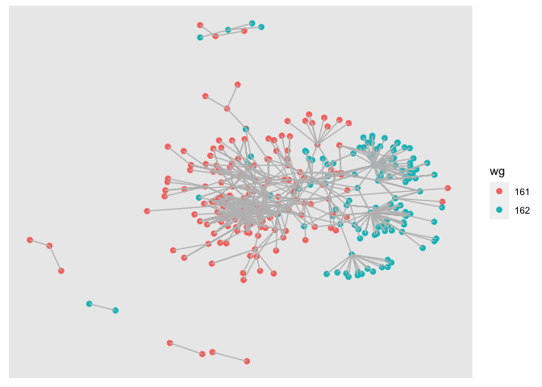
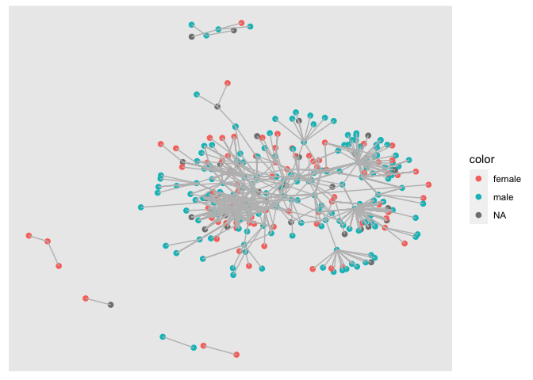

---
output:
  pdf_document: 
    latex_engine: xelatex
  html_document: default
---
Group Project
================

# Part 1: Preprocessing

## Load data

Load the following data: + applications from `app_data_sample.parquet` +
edges from `edges_sample.csv`

``` r
# change to your own path!
data_path <- "~/Desktop/McGill/ORGB/2022-ona-assignments/ex3/"
applications <- read_parquet(paste0(data_path,"app_data_sample.parquet"))
edges <- read_csv(paste0(data_path,"edges_sample.csv"))
```

    ## Rows: 32906 Columns: 4
    ## ── Column specification ────────────────────────────────────────────────────────
    ## Delimiter: ","
    ## chr  (1): application_number
    ## dbl  (2): ego_examiner_id, alter_examiner_id
    ## date (1): advice_date
    ## 
    ## ℹ Use `spec()` to retrieve the full column specification for this data.
    ## ℹ Specify the column types or set `show_col_types = FALSE` to quiet this message.

``` r
applications
```

    ## # A tibble: 2,018,477 × 16
    ##    application_number filing_date examiner_name_last examiner_name_first
    ##    <chr>              <date>      <chr>              <chr>              
    ##  1 08284457           2000-01-26  HOWARD             JACQUELINE         
    ##  2 08413193           2000-10-11  YILDIRIM           BEKIR              
    ##  3 08531853           2000-05-17  HAMILTON           CYNTHIA            
    ##  4 08637752           2001-07-20  MOSHER             MARY               
    ##  5 08682726           2000-04-10  BARR               MICHAEL            
    ##  6 08687412           2000-04-28  GRAY               LINDA              
    ##  7 08716371           2004-01-26  MCMILLIAN          KARA               
    ##  8 08765941           2000-06-23  FORD               VANESSA            
    ##  9 08776818           2000-02-04  STRZELECKA         TERESA             
    ## 10 08809677           2002-02-20  KIM                SUN                
    ## # … with 2,018,467 more rows, and 12 more variables:
    ## #   examiner_name_middle <chr>, examiner_id <dbl>, examiner_art_unit <dbl>,
    ## #   uspc_class <chr>, uspc_subclass <chr>, patent_number <chr>,
    ## #   patent_issue_date <date>, abandon_date <date>, disposal_type <chr>,
    ## #   appl_status_code <dbl>, appl_status_date <chr>, tc <dbl>

``` r
edges
```

    ## # A tibble: 32,906 × 4
    ##    application_number advice_date ego_examiner_id alter_examiner_id
    ##    <chr>              <date>                <dbl>             <dbl>
    ##  1 09402488           2008-11-17            84356             66266
    ##  2 09402488           2008-11-17            84356             63519
    ##  3 09402488           2008-11-17            84356             98531
    ##  4 09445135           2008-08-21            92953             71313
    ##  5 09445135           2008-08-21            92953             93865
    ##  6 09445135           2008-08-21            92953             91818
    ##  7 09479304           2008-12-15            61767             69277
    ##  8 09479304           2008-12-15            61767             92446
    ##  9 09479304           2008-12-15            61767             66805
    ## 10 09479304           2008-12-15            61767             70919
    ## # … with 32,896 more rows

## Get gender for examiners

We’ll get gender based on the first name of the examiner, which is
recorded in the field `examiner_name_first`. We’ll use library `gender`
for that, relying on a modified version of their own
[example](https://cran.r-project.org/web/packages/gender/vignettes/predicting-gender.html).

Note that there are over 2 million records in the applications table –
that’s because there are many records for each examiner, as many as the
number of applications that examiner worked on during this time frame.
Our first step therefore is to get all *unique* names in a separate list
`examiner_names`. We will then guess gender for each one and will join
this table back to the original dataset. So, let’s get names without
repetition:

``` r
library(gender)
#install_genderdata_package() # only run this line the first time you use the package, to get data for it
# get a list of first names without repetitions
examiner_names <- applications %>% 
  distinct(examiner_name_first)
examiner_names
```

    ## # A tibble: 2,595 × 1
    ##    examiner_name_first
    ##    <chr>              
    ##  1 JACQUELINE         
    ##  2 BEKIR              
    ##  3 CYNTHIA            
    ##  4 MARY               
    ##  5 MICHAEL            
    ##  6 LINDA              
    ##  7 KARA               
    ##  8 VANESSA            
    ##  9 TERESA             
    ## 10 SUN                
    ## # … with 2,585 more rows

Now let’s use function `gender()` as shown in the example for the
package to attach a gender and probability to each name and put the
results into the table `examiner_names_gender`

``` r
# get a table of names and gender
examiner_names_gender <- examiner_names %>% 
  do(results = gender(.$examiner_name_first, method = "ssa")) %>% 
  unnest(cols = c(results), keep_empty = TRUE) %>% 
  select(
    examiner_name_first = name,
    gender,
    proportion_female
  )
examiner_names_gender
```

    ## # A tibble: 1,822 × 3
    ##    examiner_name_first gender proportion_female
    ##    <chr>               <chr>              <dbl>
    ##  1 AARON               male              0.0082
    ##  2 ABDEL               male              0     
    ##  3 ABDOU               male              0     
    ##  4 ABDUL               male              0     
    ##  5 ABDULHAKIM          male              0     
    ##  6 ABDULLAH            male              0     
    ##  7 ABDULLAHI           male              0     
    ##  8 ABIGAIL             female            0.998 
    ##  9 ABIMBOLA            female            0.944 
    ## 10 ABRAHAM             male              0.0031
    ## # … with 1,812 more rows

Finally, let’s join that table back to our original applications data
and discard the temporary tables we have just created to reduce clutter
in our environment.

``` r
# remove extra colums from the gender table
examiner_names_gender <- examiner_names_gender %>% 
  select(examiner_name_first, gender)
# joining gender back to the dataset
applications <- applications %>% 
  left_join(examiner_names_gender, by = "examiner_name_first")
# cleaning up
rm(examiner_names)
rm(examiner_names_gender)
gc()
```

    ##            used  (Mb) gc trigger  (Mb) limit (Mb) max used  (Mb)
    ## Ncells  4645060 248.1    7918640 423.0         NA  5068148 270.7
    ## Vcells 49736994 379.5   92816697 708.2     102400 80052512 610.8

## Guess the examiner’s race

We’ll now use package `wru` to estimate likely race of an examiner. Just
like with gender, we’ll get a list of unique names first, only now we
are using surnames.

``` r
library(wru)
examiner_surnames <- applications %>% 
  select(surname = examiner_name_last) %>% 
  distinct()
examiner_surnames
```

    ## # A tibble: 3,806 × 1
    ##    surname   
    ##    <chr>     
    ##  1 HOWARD    
    ##  2 YILDIRIM  
    ##  3 HAMILTON  
    ##  4 MOSHER    
    ##  5 BARR      
    ##  6 GRAY      
    ##  7 MCMILLIAN 
    ##  8 FORD      
    ##  9 STRZELECKA
    ## 10 KIM       
    ## # … with 3,796 more rows

We’ll follow the instructions for the package outlined here
<https://github.com/kosukeimai/wru>.

``` r
examiner_race <- predict_race(voter.file = examiner_surnames, surname.only = T) %>% 
  as_tibble()
```

    ## [1] "Proceeding with surname-only predictions..."

    ## Warning in merge_surnames(voter.file): Probabilities were imputed for 698
    ## surnames that could not be matched to Census list.

``` r
examiner_race
```

    ## # A tibble: 3,806 × 6
    ##    surname    pred.whi pred.bla pred.his pred.asi pred.oth
    ##    <chr>         <dbl>    <dbl>    <dbl>    <dbl>    <dbl>
    ##  1 HOWARD       0.643   0.295    0.0237   0.005     0.0333
    ##  2 YILDIRIM     0.861   0.0271   0.0609   0.0135    0.0372
    ##  3 HAMILTON     0.702   0.237    0.0245   0.0054    0.0309
    ##  4 MOSHER       0.947   0.00410  0.0241   0.00640   0.0185
    ##  5 BARR         0.827   0.117    0.0226   0.00590   0.0271
    ##  6 GRAY         0.687   0.251    0.0241   0.0054    0.0324
    ##  7 MCMILLIAN    0.359   0.574    0.0189   0.00260   0.0463
    ##  8 FORD         0.620   0.32     0.0237   0.0045    0.0313
    ##  9 STRZELECKA   0.666   0.0853   0.137    0.0797    0.0318
    ## 10 KIM          0.0252  0.00390  0.00650  0.945     0.0198
    ## # … with 3,796 more rows

As you can see, we get probabilities across five broad US Census
categories: white, black, Hispanic, Asian and other. (Some of you may
correctly point out that Hispanic is not a race category in the US
Census, but these are the limitations of this package.)

Our final step here is to pick the race category that has the highest
probability for each last name and then join the table back to the main
applications table. See this example for comparing values across
columns: <https://www.tidyverse.org/blog/2020/04/dplyr-1-0-0-rowwise/>.
And this one for `case_when()` function:
<https://dplyr.tidyverse.org/reference/case_when.html>.

``` r
examiner_race <- examiner_race %>% 
  mutate(max_race_p = pmax(pred.asi, pred.bla, pred.his, pred.oth, pred.whi)) %>% 
  mutate(race = case_when(
    max_race_p == pred.asi ~ "Asian",
    max_race_p == pred.bla ~ "black",
    max_race_p == pred.his ~ "Hispanic",
    max_race_p == pred.oth ~ "other",
    max_race_p == pred.whi ~ "white",
    TRUE ~ NA_character_
  ))
examiner_race
```

    ## # A tibble: 3,806 × 8
    ##    surname    pred.whi pred.bla pred.his pred.asi pred.oth max_race_p race 
    ##    <chr>         <dbl>    <dbl>    <dbl>    <dbl>    <dbl>      <dbl> <chr>
    ##  1 HOWARD       0.643   0.295    0.0237   0.005     0.0333      0.643 white
    ##  2 YILDIRIM     0.861   0.0271   0.0609   0.0135    0.0372      0.861 white
    ##  3 HAMILTON     0.702   0.237    0.0245   0.0054    0.0309      0.702 white
    ##  4 MOSHER       0.947   0.00410  0.0241   0.00640   0.0185      0.947 white
    ##  5 BARR         0.827   0.117    0.0226   0.00590   0.0271      0.827 white
    ##  6 GRAY         0.687   0.251    0.0241   0.0054    0.0324      0.687 white
    ##  7 MCMILLIAN    0.359   0.574    0.0189   0.00260   0.0463      0.574 black
    ##  8 FORD         0.620   0.32     0.0237   0.0045    0.0313      0.620 white
    ##  9 STRZELECKA   0.666   0.0853   0.137    0.0797    0.0318      0.666 white
    ## 10 KIM          0.0252  0.00390  0.00650  0.945     0.0198      0.945 Asian
    ## # … with 3,796 more rows

Let’s join the data back to the applications table.

``` r
# removing extra columns
examiner_race <- examiner_race %>% 
  select(surname,race)
applications <- applications %>% 
  left_join(examiner_race, by = c("examiner_name_last" = "surname"))
rm(examiner_race)
rm(examiner_surnames)
gc()
```

    ##            used  (Mb) gc trigger  (Mb) limit (Mb) max used  (Mb)
    ## Ncells  5058499 270.2    7918640 423.0         NA  7918640 423.0
    ## Vcells 53530118 408.5   92816697 708.2     102400 92617570 706.7

## Examiner’s tenure

To figure out the timespan for which we observe each examiner in the
applications data, let’s find the first and the last observed date for
each examiner. We’ll first get examiner IDs and application dates in a
separate table, for ease of manipulation. We’ll keep examiner ID (the
field `examiner_id`), and earliest and latest dates for each application
(`filing_date` and `appl_status_date` respectively). We’ll use functions
in package `lubridate` to work with date and time values.

``` r
library(lubridate) # to work with dates
examiner_dates <- applications %>% 
  select(examiner_id, filing_date, appl_status_date) 
examiner_dates
```

    ## # A tibble: 2,018,477 × 3
    ##    examiner_id filing_date appl_status_date  
    ##          <dbl> <date>      <chr>             
    ##  1       96082 2000-01-26  30jan2003 00:00:00
    ##  2       87678 2000-10-11  27sep2010 00:00:00
    ##  3       63213 2000-05-17  30mar2009 00:00:00
    ##  4       73788 2001-07-20  07sep2009 00:00:00
    ##  5       77294 2000-04-10  19apr2001 00:00:00
    ##  6       68606 2000-04-28  16jul2001 00:00:00
    ##  7       89557 2004-01-26  15may2017 00:00:00
    ##  8       97543 2000-06-23  03apr2002 00:00:00
    ##  9       98714 2000-02-04  27nov2002 00:00:00
    ## 10       65530 2002-02-20  23mar2009 00:00:00
    ## # … with 2,018,467 more rows

The dates look inconsistent in terms of formatting. Let’s make them
consistent. We’ll create new variables `start_date` and `end_date`.

``` r
examiner_dates <- examiner_dates %>% 
  mutate(start_date = ymd(filing_date), end_date = as_date(dmy_hms(appl_status_date)))
```

Let’s now identify the earliest and the latest date for each examiner
and calculate the difference in days, which is their tenure in the
organization.

``` r
examiner_dates <- examiner_dates %>% 
  group_by(examiner_id) %>% 
  summarise(
    earliest_date = min(start_date, na.rm = TRUE), 
    latest_date = max(end_date, na.rm = TRUE),
    tenure_days = interval(earliest_date, latest_date) %/% days(1)
    ) %>% 
  filter(year(latest_date)<2018)
examiner_dates
```

    ## # A tibble: 5,625 × 4
    ##    examiner_id earliest_date latest_date tenure_days
    ##          <dbl> <date>        <date>            <dbl>
    ##  1       59012 2004-07-28    2015-07-24         4013
    ##  2       59025 2009-10-26    2017-05-18         2761
    ##  3       59030 2005-12-12    2017-05-22         4179
    ##  4       59040 2007-09-11    2017-05-23         3542
    ##  5       59052 2001-08-21    2007-02-28         2017
    ##  6       59054 2000-11-10    2016-12-23         5887
    ##  7       59055 2004-11-02    2007-12-26         1149
    ##  8       59056 2000-03-24    2017-05-22         6268
    ##  9       59074 2000-01-31    2017-03-17         6255
    ## 10       59081 2011-04-21    2017-05-19         2220
    ## # … with 5,615 more rows

Joining back to the applications data.

``` r
applications <- applications %>% 
  left_join(examiner_dates, by = "examiner_id")
rm(examiner_dates)
gc()
```

    ##            used  (Mb) gc trigger   (Mb) limit (Mb)  max used   (Mb)
    ## Ncells  5072237 270.9   14243422  760.7         NA  14243422  760.7
    ## Vcells 65908310 502.9  133832043 1021.1     102400 133496689 1018.5

# Select Work Group

In this project, we will select work group 161 and 162 to continue our
analysis on the USPTO data set.

The 162 work group is the Organic Chemistry art unit and the 161 work
group is the Organic Compounds: Bio-affecting, Body Treating, Drug
Delivery, Steroids, Herbicides, Pesticides, Cosmetics, and Drugs art
unit.

``` r
## Extract three digit art unit information
wg = as.numeric(substr(applications$examiner_art_unit, 1, 3))
applications$wg = wg

## select wg
target_groups = applications %>% filter(applications$wg == 161|applications$wg == 162)
group_161 = applications %>% filter(applications$wg == 161)
group_162 = applications %>% filter(applications$wg == 162)
```

# Descriptive Analysis

## Show how the two workgroups (161 and 162) compare on examiners’ demographics (summary statistics about gender)

``` r
# Calculate gender ratio in the workgroups 161
round(table(group_161['gender'])/dim(group_161)[1]*100,2)
```

    ## 
    ## female   male 
    ##  41.51  44.05

``` r
# Calculate gender ratio in the workgroups 162
round(table(group_162['gender'])/dim(group_162)[1]*100,2)
```

    ## 
    ## female   male 
    ##  36.36  39.17

``` r
# Calculate average gender ratio in the applications table (as a reference)
round(table(applications['gender'])/dim(applications)[1]*100,2)
```

    ## 
    ## female   male 
    ##  28.30  56.65

## Show how the two workgroups (161 and 162) compare on examiners’ demographics (summary plots about gender)

``` r
library(gridExtra)
```

    ## 
    ## Attaching package: 'gridExtra'

    ## The following object is masked from 'package:dplyr':
    ## 
    ##     combine

``` r
library(tidyverse)
plot_gender_161 <- ggplot(data=group_161, aes(x=gender)) +
  geom_bar(aes(y = (..count..)/sum(..count..)*100),color="black",fill="light yellow") + 
  theme_minimal() +
  ylab("Ratio (%)")+
  xlab("Gender")+
  ylim(0,70)+
  ggtitle(paste0("Gender Ratio for Workgroup 161"))

plot_gender_162 <- ggplot(data=group_162, aes(x=gender)) +
  geom_bar(aes(y = (..count..)/sum(..count..)*100),color="black",fill="light blue") +
  theme_minimal() +
  ylab("Ratio (%)")+
  xlab("Gender")+
  ylim(0,70)+
  ggtitle(paste0("Gender Ratio for Workgroup 162"))

plot_gender_avg <- ggplot(data=applications['gender'], aes(x=gender)) +
  geom_bar(aes(y = (..count..)/sum(..count..)*100),color="black",fill="light grey") +
  theme_minimal() +
  ylab("Ratio (%)")+
  xlab("Gender")+
  ylim(0,70)+
  ggtitle(paste0("Average Gender Ratio for Examiners in Whole Data Set"))

grid.arrange(plot_gender_161,plot_gender_162,plot_gender_avg,widths=c(1,1))
```

<!-- -->

## Show how the two workgroups (161 and 162) compare on examiners’ demographics (summary statistics about race)

``` r
# Determine racial profile in the workgroups 175
race_161 <- round(table(group_161['race'])/dim(group_161)[1]*100,2)
race_161
```

    ## 
    ##    Asian    black Hispanic    white 
    ##    21.75     2.73     2.05    73.47

``` r
# Determine racial profile in the workgroups 176
race_162 <- round(table(group_162['race'])/dim(group_162)[1]*100,2)
race_162
```

    ## 
    ##    Asian    black Hispanic    white 
    ##    25.07     7.80     2.75    64.39

``` r
# Determine racial profile in the applications table (as a reference)
race_avg <- round(table(applications['race'])/dim(applications)[1]*100,2)
race_avg
```

    ## 
    ##    Asian    black Hispanic    other    white 
    ##    29.18     4.46     2.96     0.02    63.38

## Show how the two workgroups (161 and 162) compare on examiners’ demographics (summary plots about gender)

``` r
par(mfrow=c(1,3)) 
lbls <- c("Asian", "black", "Hispanic", "white")
lbls_o <- c("Asian", "black", "Hispanic", "other", "white")

plot_race_161 <- pie(race_161,labels = lbls, col=terrain.colors(length(race_161)),main = "Racial Profile in Workgroups 161",clockwise = TRUE)

plot_race_162 <- pie(race_162,labels = lbls, col=terrain.colors(length(race_162)),main = "Racial Profile in Workgroups 162",clockwise = TRUE)

plot_race_avg <- pie(race_avg,labels = lbls_o, col=terrain.colors(length(race_avg)),main = "Average Racial Profile Examiners",clockwise = TRUE)
```

<!-- --> \#
Create advice advice\_networks from edges\_sample \#\# Create Edge
dataset

``` r
network = inner_join(target_groups,edges,by = c("application_number" = "application_number"))
network = network %>% select(ego_examiner_id,alter_examiner_id,gender,race,examiner_art_unit,wg)
network = network %>%mutate(wg = as.character(wg)) %>% mutate(examiner_art_unit = as.character(examiner_art_unit))
network = drop_na(network)
head(network)
```

    ## # A tibble: 6 × 6
    ##   ego_examiner_id alter_examiner_id gender race     examiner_art_unit wg   
    ##             <dbl>             <dbl> <chr>  <chr>    <chr>             <chr>
    ## 1           96070             92569 female white    1616              161  
    ## 2           82105             70571 male   Hispanic 1616              161  
    ## 3           82105             76964 male   Hispanic 1616              161  
    ## 4           91989             72814 female white    1614              161  
    ## 5           91989             71059 female white    1614              161  
    ## 6           73364             72814 male   white    1629              162

## Create Nodes dataset

``` r
egoNodes = subset(network, select=c(ego_examiner_id,examiner_art_unit, wg)) %>% rename(examiner_id=ego_examiner_id,art_unit=examiner_art_unit,wg=wg)
alterNodes = subset(network, select=c(alter_examiner_id,examiner_art_unit, wg))%>% rename(examiner_id=alter_examiner_id,art_unit=examiner_art_unit,wg=wg)
nodes = rbind(egoNodes, alterNodes)
nodes = distinct(nodes)

nodes = nodes %>% group_by(examiner_id) %>% summarise(examiner_id=first(examiner_id), art_unit=first(art_unit), wg=first(wg))
nodes
```

    ## # A tibble: 283 × 3
    ##    examiner_id art_unit wg   
    ##          <dbl> <chr>    <chr>
    ##  1       59399 1616     161  
    ##  2       59428 1611     161  
    ##  3       59511 1612     161  
    ##  4       59632 1613     161  
    ##  5       59650 1618     161  
    ##  6       59811 1616     161  
    ##  7       59868 1616     161  
    ##  8       59907 1616     161  
    ##  9       59908 1616     161  
    ## 10       60043 1617     161  
    ## # … with 273 more rows

## Create graph

``` r
library(igraph)
```

    ## 
    ## Attaching package: 'igraph'

    ## The following objects are masked from 'package:lubridate':
    ## 
    ##     %--%, union

    ## The following objects are masked from 'package:dplyr':
    ## 
    ##     as_data_frame, groups, union

    ## The following objects are masked from 'package:purrr':
    ## 
    ##     compose, simplify

    ## The following object is masked from 'package:tidyr':
    ## 
    ##     crossing

    ## The following object is masked from 'package:tibble':
    ## 
    ##     as_data_frame

    ## The following objects are masked from 'package:stats':
    ## 
    ##     decompose, spectrum

    ## The following object is masked from 'package:base':
    ## 
    ##     union

``` r
library(ggraph)
network_graph = graph_from_data_frame(d=network, vertices=nodes, directed=TRUE)
network_graph
```

    ## IGRAPH 139e273 DN-- 283 1116 -- 
    ## + attr: name (v/c), art_unit (v/c), wg (v/c), gender (e/c), race (e/c),
    ## | examiner_art_unit (e/c), wg (e/c)
    ## + edges from 139e273 (vertex names):
    ##  [1] 96070->92569 82105->70571 82105->76964 91989->72814 91989->71059
    ##  [6] 73364->72814 73364->98081 61417->82244 61417->72004 61417->83224
    ## [11] 90588->62480 92462->67256 90588->82244 90588->62480 59811->67581
    ## [16] 59811->70571 59811->67256 59811->64900 90588->62480 63388->67256
    ## [21] 59811->72814 59811->67581 91688->71059 91688->71059 67690->61180
    ## [26] 67690->71948 67690->66206 67690->71259 67690->98700 67690->93403
    ## [31] 67690->97808 67690->78807 67690->64315 67690->68486 67690->60377
    ## + ... omitted several edges

## Plotting Network

``` r
V(network_graph)$color = nodes$art_unit
graphnetwork <- ggraph(network_graph, layout = "kk") +                                         
  geom_node_point(size = 2, aes(color = wg) ) +  
  geom_node_text(aes(label = ""), nudge_y = 0.05, nudge_x = 0.2)+ 
  geom_edge_link(edge_color="grey")
graphnetwork
```

<!-- -->

## Colorcoding with Gender

Use gender as node color to see how different gender interact in the
network

``` r
V(network_graph)$color = applications$gender
```

    ## Warning in vattrs[[name]][index] <- value: number of items to replace is not a
    ## multiple of replacement length

``` r
graphnetwork <- ggraph(network_graph, layout = "kk") +                                         
  geom_node_point(size = 2, aes(color = color) ) +  
  geom_node_text(aes(label = ""), nudge_y = 0.05, nudge_x = 0.2)+ 
  geom_edge_link(edge_color="grey")
graphnetwork
```

<!-- --> \#\#
Colorcoding with Race Use gender as node color to see how different race
interact in the network

``` r
V(network_graph)$color = applications$race
```

    ## Warning in vattrs[[name]][index] <- value: number of items to replace is not a
    ## multiple of replacement length

``` r
graphnetwork <- ggraph(network_graph, layout = "kk") +                                         
  geom_node_point(size = 2, aes(color = color) ) +  
  geom_node_text(aes(label = ""), nudge_y = 0.05, nudge_x = 0.2)+ 
  geom_edge_link(edge_color="grey")
graphnetwork
```

<!-- --> \#
Calculate Centrality Score 1. Degree centrality is defined as the number
of links incident upon a node 2. Eigenvector Centrality is an algorithm
that measures the transitive influence of nodes. A high eigenvector
score means that a node is connected to many nodes who themselves have
high scores. 3. Closeness centrality is a measure of the average
shortest distance from each vertex to each other vertex 4. Betweenness
centrality is a way of detecting the amount of influence a node has over
the flow of information in a graph.

``` r
## Degree Centrality
V(network_graph)$dc <- degree(network_graph)

## Eigenvector Centrality
V(network_graph)$ec <- evcent(network_graph)$vector

## Closeness Centrality
V(network_graph)$cc <- closeness(network_graph)

## Betweenness Centrality
V(network_graph)$bc <- betweenness(network_graph)
```

## Plotting 4 types of degree centrality

``` r
library(ggraph)
library(ggplot2)
library(ggpubr)
# Degree Centrality
network_graph_dc = ggraph(network_graph, layout="kk") +
  geom_edge_link(edge_color="grey")+
  geom_node_point(aes(size=dc,color=nodes$wg), show.legend=T) + ggtitle("Degree Centrality")

# Eigenvector Centrality
network_graph_ec<-ggraph(network_graph, layout="kk") +
  geom_edge_link(edge_color="grey")+
  geom_node_point(aes(size=ec,color=nodes$wg), show.legend=T) + ggtitle("Eigenvector Centrality")

# Closeness Centrality
network_graph_cc<-ggraph(network_graph, layout="kk") +
  geom_edge_link(edge_color="grey")+
  geom_node_point(aes(size=cc,color=nodes$wg), show.legend=T) + ggtitle("Closeness Centrality")

# Betweenness Centrality
network_graph_bc<-ggraph(network_graph, layout="kk") +
  geom_edge_link(edge_color="grey")+
  geom_node_point(aes(size=bc,color=nodes$wg), show.legend=T) + ggtitle("Betwenness Centrality")
```

``` r
ggarrange(network_graph_dc,network_graph_ec,network_graph_cc,network_graph_bc,ncol = 2, nrow = 2)
```

    ## Warning: Removed 199 rows containing missing values (geom_point).

<!-- --> Based
on the 4 plots, it seems like closeness centrality can help identify the
high centrality score nodes from other nodes.

## Closeness Centrality plot with label

``` r
ggraph(network_graph, layout="kk") +
  geom_edge_link(edge_color="grey")+geom_node_text(aes(label = nodes$examiner_id), repel=TRUE, size=2)+
  geom_node_point(aes(size=cc,color=nodes$wg), show.legend=T) + ggtitle("Closeness Centrality")
```

    ## Warning: Removed 199 rows containing missing values (geom_point).

    ## Warning: ggrepel: 180 unlabeled data points (too many overlaps). Consider
    ## increasing max.overlaps

<!-- -->
